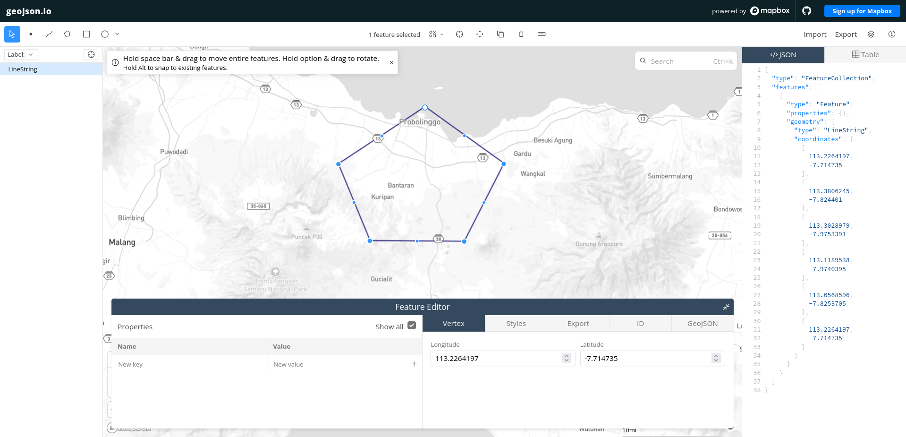
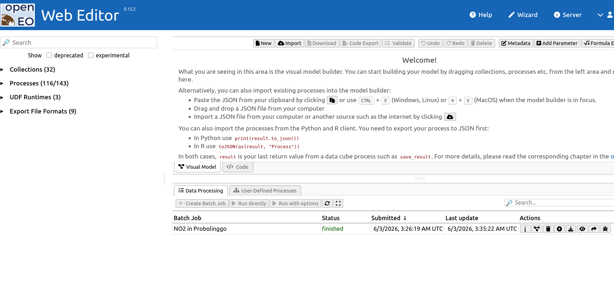
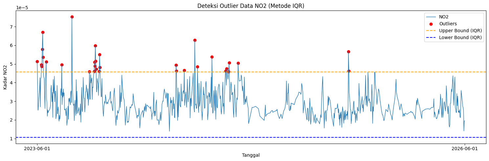
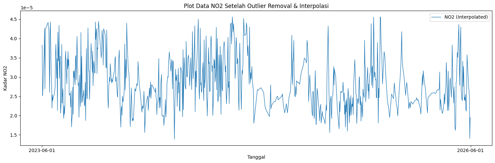

# Prediksi Kadar NO2 di Wilayah Probolinggo

## Gambaran Umum

Pertumbuhan aktivitas industri, mobilitas transportasi, dan laju pertambahan penduduk yang tinggi telah mendorong kenaikan pencemaran udara di banyak daerah. Salah satu polutan yang paling diperhatikan adalah Nitrogen Dioksida (NO2), yaitu gas berbahaya yang umumnya muncul dari proses pembakaran bahan bakar fosil, seperti kendaraan bermotor, pembangkit listrik, dan aktivitas industri. NO2 dapat menimbulkan dampak serius bagi kesehatan, mulai dari gangguan pernapasan, iritasi paru, sampai memperparah asma dan bronkitis. Di sisi lain, gas ini juga ikut berperan dalam pembentukan hujan asam serta menurunkan kualitas lingkungan secara umum.

## 1. Pengambilan Data

Langkah awal yang dilakukan adalah mengambil data deret waktu harian kadar NO2 di wilayah Probolinggo. Data diambil dari situs <https://dataspace.copernicus.eu/>. Sebelum melanjutkan, pastikan sudah membuat akun pada platform Copernicus tersebut.

Pada bagian ini, data NO2 Probolinggo akan diambil untuk rentang tanggal 1 Jun 2023 hingga 1 Jun 2026.

Sebelum mulai, pasang terlebih dahulu `openeo`:

```bash
pip install openeo
```

Setelah itu, jalankan kode berikut:

```python
import openeo

connection = openeo.connect("openeo.dataspace.copernicus.eu").authenticate_oidc()
```

Saat baris kode di atas (`connection`) dijalankan, sistem akan meminta
proses autentikasi dengan keluaran seperti berikut:

```
Visit {link} 📋 to authenticate.
✅ Authorized successfully

Authenticated using device code flow.
```

Klik tautan autentikasi yang muncul, lalu masuk menggunakan akun Copernicus yang dimiliki.

```python
aoi = {
    "type": "Polygon",
    "coordinates": [
        [
            [113.2264197, -7.714735],
            [113.3806245, -7.824401],
            [113.3028979, -7.9753391],
            [113.1189538, -7.9740395],
            [113.0568596, -7.8253705],
            [113.2264197, -7.714735],
        ]
    ]
}

s5post = connection.load_collection(
    "SENTINEL_5P_L2",
    temporal_extent=["2023-06-01", "2026-06-01"],
    spatial_extent={
        "west": 113.0568596,
        "south": -7.9740395,
        "east": 113.3806245,
        "north": -7.714735
    },
    bands=["NO2"],
)

# Now aggregate by day to avoid having multiple data per day
s5p_no2_daily = s5post.aggregate_temporal_period(reducer="mean", period="day")

# Now create a spatial aggregation to generate mean timeseries data
s5p_no2_aoi = s5p_no2_daily.aggregate_spatial(reducer="mean", geometries=aoi)
```

Kode tersebut membutuhkan koordinat area yang akan dijadikan sumber data NO2. Untuk menentukan koordinatnya, buka situs <https://geojson.io>. Di sana, pilih area yang diinginkan dengan menggambar bentuk pada wilayah yang akan diambil datanya.



Pada panel sebelah kanan tersedia JSON berisi koordinat wilayah yang
dipilih. Salin data tersebut, lalu sesuaikan dengan kode sebelumnya pada
bagian variabel "aoi" dan spatial_extent.

Kemudian tambahkan baris kode berikut untuk memulai proses pengambilan data:

```python
job = s5post.execute_batch(title="NO2 in Probolinggo", outputfile="NO2Probolinggo.nc")
```

Tunggu proses pengambilan data, output proses seperti berikut:

```
0:00:00 Job 'j-260603032619403ab346cb67c816b0c0': send 'start'
0:00:12 Job 'j-260603032619403ab346cb67c816b0c0': queued (progress 0%)
0:00:17 Job 'j-260603032619403ab346cb67c816b0c0': queued (progress 0%)
0:00:23 Job 'j-260603032619403ab346cb67c816b0c0': queued (progress 0%)
0:00:31 Job 'j-260603032619403ab346cb67c816b0c0': queued (progress 0%)
0:00:41 Job 'j-260603032619403ab346cb67c816b0c0': queued (progress 0%)
0:00:54 Job 'j-260603032619403ab346cb67c816b0c0': queued (progress 0%)
0:01:09 Job 'j-260603032619403ab346cb67c816b0c0': running (progress N/A)
0:01:29 Job 'j-260603032619403ab346cb67c816b0c0': running (progress N/A)
0:01:53 Job 'j-260603032619403ab346cb67c816b0c0': running (progress N/A)
0:02:23 Job 'j-260603032619403ab346cb67c816b0c0': running (progress N/A)
0:03:00 Job 'j-260603032619403ab346cb67c816b0c0': running (progress N/A)
0:03:47 Job 'j-260603032619403ab346cb67c816b0c0': running (progress N/A)
0:04:45 Job 'j-260603032619403ab346cb67c816b0c0': running (progress N/A)
0:05:46 Job 'j-260603032619403ab346cb67c816b0c0': running (progress N/A)
0:06:46 Job 'j-260603032619403ab346cb67c816b0c0': running (progress N/A)
0:07:46 Job 'j-260603032619403ab346cb67c816b0c0': running (progress N/A)
0:08:46 Job 'j-260603032619403ab346cb67c816b0c0': running (progress N/A)
0:09:47 Job 'j-260603032619403ab346cb67c816b0c0': finished (progress 100%)
```

Abaikan ketika ada N/A.

Selama proses pengambilan data, aktivitas akan tercatat di halaman <https://editor.openeo.org/?server=https%3A%2F%2Fopeneo.dataspace.copernicus.eu%2Fopeneo%2F1.2>. Di sana akan terlihat nama dataset dan status pengambilan data.



## 2. Praproses Data

Setelah data berhasil diambil, file dapat diunduh melalui halaman <https://editor.openeo.org/?server=https%3A%2F%2Fopeneo.dataspace.copernicus.eu%2Fopeneo%2F1.2>. File yang diperoleh berbentuk .nc. Dari file tersebut, kita hanya memerlukan kolom date dan NO2 dengan bantuan kode berikut:

```bash
pip install netCDF4
```

```python
import netCDF4

file_path = "NO2Probolinggo.nc"
ds = netCDF4.Dataset(file_path)

# Tampilkan variabel yang tersedia
print("📦 Variabel dalam file:")
print(ds.variables.keys())
# dict_keys(['t', 'x', 'y', 'crs', 'NO2'])

# Ekstrak data NO2
no2 = ds.variables["NO2"][:]

# Ekstrak data waktu
time = ds.variables["t"][:]

# Konversi waktu ke format tanggal jika punya atribut 'units'
try:
    time_units = ds.variables["t"].units
    dates = netCDF4.num2date(time, units=time_units)
except Exception:
    dates = time  # fallback jika tidak ada units

# Tampilkan struktur data NO2
print(type(no2))
# Tipe: numpy.ma.core.MaskedArray

print(len(no2))
# Jumlah waktu: 1098

print(len(no2[0]))
# Dimensi y: 8

print(len(no2[0][0]))
# Dimensi x: 6

print(no2[0][0][0])
# Contoh nilai: 1.5991e-05
```

Melalui kode di atas, kita bisa melihat bentuk data pada kolom NO2.

Jadi, struktur data NO2 per baris dapat digambarkan sebagai berikut:

```python
[
    [[] * 6] * 8
]
```

Untuk melihat 10 data pertama, gunakan kode berikut:

```python
print("Contoh data pertama:")
for i in range(0, 10):
    print(no2[i])
```

Dalam satu hari, data NO2 jumlahnya cukup banyak, sehingga perlu dirata-ratakan agar setiap cell hanya memiliki satu nilai. Namun, data NO2 juga memiliki kendala berupa missing value. Contohnya dapat dilihat pada keluaran di bawah ini:

```
[1.5991034160833806e-05 3.192083022440784e-05 -- -- -- --]
```

### a. Mengisi Missing Value dengan Interpolasi Linear

Berikutnya, missing value pada data NO2 akan ditangani terlebih dahulu.

```python
import numpy as np
import pandas as pd

# Siapkan array untuk NO2 yang sudah diisi
no2_filled = np.zeros_like(no2)
no2_filled = no2_filled.filled(0)

# Loop setiap grid spatial (y, x)
for i in range(no2.shape[1]):
    for j in range(no2.shape[2]):
        series = pd.Series(no2[:, i, j])
        no2_filled[:, i, j] = series.interpolate(method='linear', limit_direction='both').to_numpy()
```

Kode di atas akan mengisi missing value pada data NO2 secara otomatis menggunakan metode interpolasi linear.

### b. Menghitung Rata-rata dan Mengubah Datetime

Setelah missing value diperbaiki, data NO2 kemudian dirata-ratakan agar satu record hanya berisi satu nilai. Sekaligus, tanggalnya diambil dan disimpan ke dalam array. Format datetime juga diubah dari (2023-06-04 00:00:00) menjadi (2023-06-04), karena data yang digunakan adalah deret waktu harian sehingga komponen jam, menit, dan detik tidak diperlukan.

```python
new_dates = []
new_no2 = []
for i in range(len(dates)):
    # ubah format datetime
    new_date = dates[i].strftime('%Y-%m-%d')
    new_dates.append(new_date)
    new_no2.append(np.mean(no2_filled[i]))
```

### c. Menyimpan Data ke CSV

Setelah itu, data akan dibentuk menjadi DataFrame Pandas untuk disimpan
ke dalam format CSV.

```python
df = pd.DataFrame({
    "date": new_dates,
    "NO2": new_no2
})

# Simpan DataFrame ke file CSV
df.to_csv("NO2_Probolinggo_timeseries.csv", index=False)
```

Proses pengisian missing value dan penyimpanan ke CSV telah berhasil dilakukan.

### d. Memeriksa Missing Value Harian pada CSV

Setelah data tersimpan dalam bentuk CSV, langkah berikutnya adalah memeriksa apakah deret waktu hariannya sudah lengkap. Untuk itu, gunakan kode berikut:

```python
import pandas as pd
import numpy as np

df = pd.read_csv("NO2_Probolinggo_timeseries.csv")

# Konversi kolom 'date' ke tipe datetime
df['date'] = pd.to_datetime(df['date'])

# Buat rangkaian tanggal lengkap
start_date = "2023-06-01"
end_date = "2026-06-01"
full_range = pd.date_range(start=start_date, end=end_date, freq='D')

# Identifikasi tanggal yang hilang
missing_dates = full_range.difference(df['date'])

print(f"Jumlah hari missing: {len(missing_dates)}")
print("Daftar tanggal missing:")
print(missing_dates)
```

```
Jumlah hari missing: 8
Daftar tanggal missing:
DatetimeIndex(['2023-11-11', '2024-01-01', '2024-03-11', '2024-03-23',
               '2024-08-12', '2025-01-30', '2025-01-31', '2026-06-01'],
              dtype='datetime64[ns]', freq=None)
```

Pada kasus ini, masih ditemukan 8 hari yang hilang. Missing value
tersebut akan diperbaiki kembali dengan interpolasi linear. Kode yang
digunakan adalah sebagai berikut:

```python
import pandas as pd

# Baca file CSV dan set 'date' sebagai index
df = pd.read_csv("NO2_Probolinggo_timeseries.csv")
df['date'] = pd.to_datetime(df['date'])
df = df.set_index('date').sort_index()

# Buat rangkaian tanggal lengkap
full_range = pd.date_range(start="2023-06-01", end="2026-06-01", freq='D')

# Reindex untuk menampilkan tanggal yang hilang sebagai NaN
df = df.reindex(full_range)
df.index.name = 'date'

# Interpolasi linear berdasarkan waktu
df['NO2'] = df['NO2'].interpolate(method='time')

# Forward-fill dan backward-fill untuk NaN di awal/akhir
df['NO2'] = df['NO2'].fillna(method='bfill').fillna(method='ffill')
```

Setelah pengecekan dilakukan, tidak ditemukan lagi missing value pada data harian.

```
Jumlah hari missing: 0
Daftar tanggal missing:
DatetimeIndex([], dtype='datetime64[ns]', freq='D')
```

Dengan hasil tersebut, data akhirnya memiliki dua kolom: kolom pertama berisi tanggal, sedangkan kolom kedua berisi kadar NO2 yang sudah dirata-ratakan.

### e. Deteksi Outlier dengan IQR

Setelah missing value diperbaiki dengan interpolasi linear, tahap selanjutnya adalah mendeteksi outlier menggunakan metode IQR.

```python
import pandas as pd
import numpy as np
import matplotlib.pyplot as plt

df = pd.read_csv("no2_timeseries_interpolated.csv")

df['date'] = pd.to_datetime(df['date'])

# Hitung quartile dan IQR
Q1 = df['NO2'].quantile(0.25)
Q3 = df['NO2'].quantile(0.75)
IQR = Q3 - Q1

# Tentukan batas outlier
lower_bound = Q1 - 1.5 * IQR
upper_bound = Q3 + 1.5 * IQR

# Identifikasi outlier
outliers_iqr = df[(df['NO2'] < lower_bound) | (df['NO2'] > upper_bound)]
```

```
Jumlah Outlier (IQR): 32
         date       NO2
0  2023-06-01  0.000051
11 2023-06-12  0.000050
12 2023-06-13  0.000049
13 2023-06-14  0.000058
14 2023-06-15  0.000067
```

Untuk memvisualisasikan outlier, gunakan kode berikut:

```python
# Buat visualisasi deteksi outlier
plt.figure(figsize=(15,5))
plt.plot(df['date'], df['NO2'], label="NO2", linewidth=1)

# Plot titik outlier
plt.scatter(outliers_iqr['date'], outliers_iqr['NO2'],
            color='red', marker='o', label="Outliers")

# Garis threshold
plt.axhline(upper_bound, color='orange', linestyle='dashed', label="Upper Bound (IQR)")
plt.axhline(lower_bound, color='blue', linestyle='dashed', label="Lower Bound (IQR)")

plt.title("Deteksi Outlier Data NO2 (Metode IQR)")
plt.xlabel("Tanggal")
plt.ylabel("Kadar NO2")
plt.legend()
plt.tight_layout()
plt.xticks(
    ticks=[df['date'].iloc[0], df['date'].iloc[-1]],
    labels=[df['date'].iloc[0].strftime('%Y-%m-%d'),
            df['date'].iloc[-1].strftime('%Y-%m-%d')]
)
plt.show()
```



Setelah outlier teridentifikasi, data tersebut akan dihapus terlebih dahulu. Karena data yang digunakan merupakan deret waktu, nilai outlier yang dihapus akan diisi ulang menggunakan interpolasi linear.

```python
# Mask outlier sebagai NaN
df['NO2_cleaned'] = df['NO2'].mask((df['NO2'] < lower_bound) | (df['NO2'] > upper_bound))
print("Jumlah outlier:", df['NO2_cleaned'].isna().sum())

# Interpolasi untuk mengisi outlier
df['NO2_filled'] = df['NO2_cleaned'].interpolate(method='linear')
df['NO2_filled'] = df['NO2_filled'].bfill().ffill()
print("Missing value setelah interpolasi:", df['NO2_filled'].isna().sum())
```

Visualisasi data setelah outlier dihapus dan diisi kembali dengan interpolasi linear:

```python
plt.figure(figsize=(15,5))
# Plot data setelah interpolasi
plt.plot(df['date'], df['NO2_filled'], label="NO2 (Interpolated)", linewidth=1)
plt.xticks(
    ticks=[df['date'].iloc[0], df['date'].iloc[-1]],
    labels=[df['date'].iloc[0].strftime('%Y-%m-%d'),
            df['date'].iloc[-1].strftime('%Y-%m-%d')]
)
plt.title("Plot Data NO2 Setelah Outlier Removal & Interpolasi")
plt.xlabel("Tanggal")
plt.ylabel("Kadar NO2")
plt.legend()
plt.tight_layout()
plt.show()
```



## 3. Pemodelan dengan KNN Regression

Dengan data deret waktu harian kadar NO2 di Probolinggo, tujuan selanjutnya adalah memprediksi kadar NO2 satu hari ke depan. Pada tahap ini, data akan diubah untuk mencari hubungan antara satu hari dengan beberapa hari sebelumnya. Selain itu, akan dibandingkan juga apakah semakin banyak hari sebelumnya, performa model ikut meningkat.

### a. Uji Korelasi Data

Sebelum masuk ke tahap pemodelan, data masih berada dalam bentuk
unsupervised sehingga belum memiliki label. Karena itu, data akan diubah
menjadi supervised terlebih dahulu, lalu korelasinya terhadap label (t)
akan diuji. Fiturnya terdiri dari 30 hari sebelumnya (t-30, t-29, \...
t-1), sedangkan labelnya adalah (t).

```python
import pandas as pd

def create_supervised(data, n_lag=4):
    df_supervised = pd.DataFrame()

    # Buat fitur lag
    for i in range(n_lag, 0, -1):
        df_supervised[f'NO2(t-{i})'] = data.shift(i)

    # Tambahkan target
    df_supervised['NO2(t)'] = data

    # Hapus baris dengan NaN
    df_supervised.dropna(inplace=True)

    return df_supervised

# Buat data supervised dengan 30 lag
supervised_df30 = create_supervised(df['NO2_filled'], n_lag=30)

# Hitung korelasi setiap lag terhadap target
lag_cols = supervised_df30.drop(columns="NO2(t)").columns
correlations = supervised_df30[lag_cols].corrwith(supervised_df30['NO2(t)'])
print(correlations)
```

```
NO2(t-30)    0.211984
NO2(t-29)    0.211496
NO2(t-28)    0.220829
NO2(t-27)    0.225748
NO2(t-26)    0.227388
NO2(t-25)    0.212842
NO2(t-24)    0.221842
NO2(t-23)    0.199859
NO2(t-22)    0.220313
NO2(t-21)    0.250760
NO2(t-20)    0.228258
NO2(t-19)    0.211761
NO2(t-18)    0.188526
NO2(t-17)    0.202442
NO2(t-16)    0.222127
NO2(t-15)    0.209191
NO2(t-14)    0.204095
NO2(t-13)    0.174071
NO2(t-12)    0.177627
NO2(t-11)    0.209214
NO2(t-10)    0.258804
NO2(t-9)     0.257744
NO2(t-8)     0.306587
NO2(t-7)     0.359005
NO2(t-6)     0.390902
NO2(t-5)     0.420111
NO2(t-4)     0.444095
NO2(t-3)     0.503943
NO2(t-2)     0.584967
NO2(t-1)     0.735705
dtype: float64
```

Nilai korelasi berada pada rentang -1 sampai 1. Dalam kasus ini, fitur
yang paling baik adalah yang memiliki nilai korelasi di atas 0.5, yaitu
fitur t-1 sampai t-4.

### b. Transformasi Data

Selanjutnya, data akan diubah dari bentuk sebelumnya menjadi data
dengan 2 hari ke belakang yang menghasilkan 3 kolom, yaitu
t-2, t-1, dan t sebagai label. Hal ini dilakukan karena hasil
uji korelasi menunjukkan bahwa dua fitur tersebut memiliki hubungan
terbaik, yaitu lebih dari 0.5. Selain itu, dibuat juga data dengan 10
hari sebelumnya untuk membandingkan apakah penambahan jumlah lag benar-
benar memperbaiki model.

```python
supervised_df = create_supervised(df['NO2_scaled'], n_lag=2)

print(supervised_df)
print(supervised_df.shape)
```

```
      NO2(t-2)  NO2(t-1)    NO2(t)
2     0.608901  0.396232  0.183563
3     0.396232  0.183563  0.215945
4     0.183563  0.215945  0.279305
5     0.215945  0.279305  0.321600
6     0.279305  0.321600  0.365034
...        ...       ...       ...
1092  0.260330  0.218847  0.206466
1093  0.218847  0.206466  0.182345
1094  0.206466  0.182345  0.002686
1095  0.182345  0.002686  0.090599
1096  0.002686  0.090599  0.090599

[1095 rows x 3 columns]
(1095, 3)
```

Untuk membuat data dengan 10 hari sebelumnya, cukup ubah parameter
`n_lag` pada kode berikut.

```python
supervised_df10 = create_supervised(df['NO2_scaled'], n_lag=10)

print(supervised_df10)
print(supervised_df10.shape)
```

```
      NO2(t-10)  NO2(t-9)  NO2(t-8)  NO2(t-7)  NO2(t-6)  NO2(t-5)  NO2(t-4)  \
10     0.608901  0.396232  0.183563  0.215945  0.279305  0.321600  0.365034
11     0.396232  0.183563  0.215945  0.279305  0.321600  0.365034  0.468387
12     0.183563  0.215945  0.279305  0.321600  0.365034  0.468387  0.212618
13     0.215945  0.279305  0.321600  0.365034  0.468387  0.212618  0.458426
14     0.279305  0.321600  0.365034  0.468387  0.212618  0.458426  0.468700
...         ...       ...       ...       ...       ...       ...       ...
1092   0.161685  0.189094  0.124995  0.118956  0.221205  0.356047  0.320779
1093   0.189094  0.124995  0.118956  0.221205  0.356047  0.320779  0.290554
1094   0.124995  0.118956  0.221205  0.356047  0.320779  0.290554  0.260330
1095   0.118956  0.221205  0.356047  0.320779  0.290554  0.260330  0.218847
1096   0.221205  0.356047  0.320779  0.290554  0.260330  0.218847  0.206466

      NO2(t-3)  NO2(t-2)  NO2(t-1)    NO2(t)
10    0.468387  0.212618  0.458426  0.468700
11    0.212618  0.458426  0.468700  0.581147
12    0.458426  0.468700  0.581147  0.567561
13    0.468700  0.581147  0.567561  0.716322
14    0.581147  0.567561  0.716322  0.863053
...        ...       ...       ...       ...
1092  0.290554  0.260330  0.218847  0.206466
1093  0.260330  0.218847  0.206466  0.182345
1094  0.218847  0.206466  0.182345  0.002686
1095  0.206466  0.182345  0.002686  0.090599
1096  0.182345  0.002686  0.090599  0.090599

[1087 rows x 11 columns]
(1087, 11)
```

### c. Pemodelan dan Evaluasi {#d-modeling-dan-evaluation}

Setelah dua bentuk data tersebut disiapkan, model akan dilatih menggunakan KNN Regression.

```python
from sklearn.neighbors import KNeighborsRegressor
from sklearn.model_selection import train_test_split
from sklearn.metrics import mean_squared_error, r2_score
import numpy as np

def MAPE(y_true, y_pred):
    y_true, y_pred = np.array(y_true), np.array(y_pred)
    # Hindari pembagian dengan nol
    nonzero = y_true != 0
    return np.mean(np.abs((y_true[nonzero] - y_pred[nonzero]) / y_true[nonzero])) * 100

def train_knn(df_supervised, model_name=""):
    # Pisahkan fitur dan label
    X = df_supervised.drop(columns=['NO2(t)']).values
    y = df_supervised['NO2(t)'].values

    # Split train-test (80-20)
    X_train, X_test, y_train, y_test = train_test_split(
        X, y, test_size=0.2, shuffle=False
    )

    # Inisialisasi dan latih model KNN
    knn = KNeighborsRegressor(n_neighbors=5)
    knn.fit(X_train, y_train)

    # Prediksi pada test set
    y_pred = knn.predict(X_test)

    # Hitung metrik evaluasi
    mse = mean_squared_error(y_test, y_pred)
    rmse = np.sqrt(mse)
    r2 = r2_score(y_test, y_pred)
    mape = MAPE(y_test, y_pred)

    print(f"\n=== {model_name} ===")
    print(f"Train Size: {len(X_train)} — Test Size: {len(X_test)}")
    print(f"RMSE: {rmse:.6f}")
    print(f"R² Score: {r2:.4f}")
    print(f"MAPE: {mape:.4f}%")

    return knn, y_test, y_pred


# Latih KNN dengan 2 lag (contoh dari data)
knn_2, y_test_2, y_pred_2 = train_knn(supervised_df, "KNN - 2 Lag")

# Latih KNN dengan 10 lag
knn_10, y_test_10, y_pred_10 = train_knn(supervised_df10, "KNN - 10 Lag")
```

```
=== KNN - 4 Hari Sebelumnya ===
Train Size: 874 — Test Size: 219
RMSE: 0.054354
R² Score: 0.4804
MAPE: 42.8681%

=== KNN - 10 Hari Sebelumnya ===
Train Size: 869 — Test Size: 218
RMSE: 0.059691
R² Score: 0.3703
MAPE: 58.7099%
```

Berdasarkan hasil evaluasi di atas, terlihat bahwa penambahan hari
sebelumnya tidak selalu membuat model menjadi lebih baik. Untuk
membuktikannya, data 30 hari sebelumnya juga akan diuji.

```python
knn_30, y_test_30, y_pred_30 = train_knn(supervised_df30, "KNN - 30 Lag")
```

```
=== KNN - 30 Hari Sebelumnya ===
Train Size: 853 — Test Size: 214
RMSE: 0.000005
R² Score: -0.0265
MAPE: 12.6548%
```

Hasil evaluasi model KNN Regression menunjukkan bahwa peningkatan jumlah
fitur historis (lag) tidak serta merta meningkatkan performa prediksi.
Pada model dengan 4 hari sebelumnya, nilai RMSE paling kecil dan R²
masih positif sehingga model mampu menjelaskan sebagian kecil
variabilitas data target. Namun, ketika jumlah lag ditambah menjadi 10
dan 30 hari sebelumnya, performa model justru menurun yang ditunjukkan
oleh meningkatnya nilai RMSE dan MAPE, serta penurunan nilai R² hingga
bernilai negatif pada lag 30. Nilai MAPE yang cukup tinggi pada seluruh
model (lebih dari 60%) juga mengindikasikan bahwa akurasi prediksi masih
rendah dan terdapat deviasi besar antara nilai prediksi dan nilai
aktual. Secara keseluruhan, model KNN tidak memberikan performa yang
baik pada data ini, dan penambahan fitur historis justru menyebabkan
overfitting serta menurunkan kemampuan generalisasi model. Oleh karena
itu, diperlukan pemilihan model lain atau peningkatan strategi
preprocessing untuk memperoleh hasil prediksi yang lebih baik.
