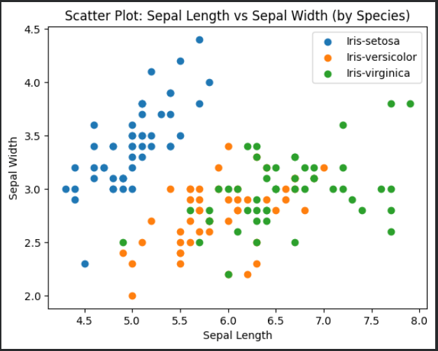
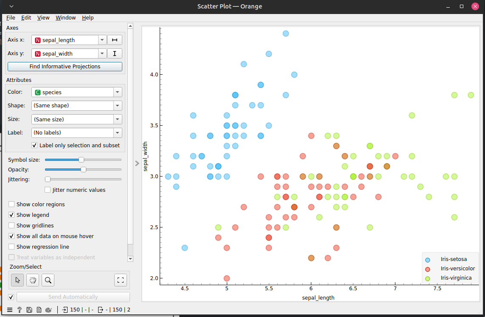
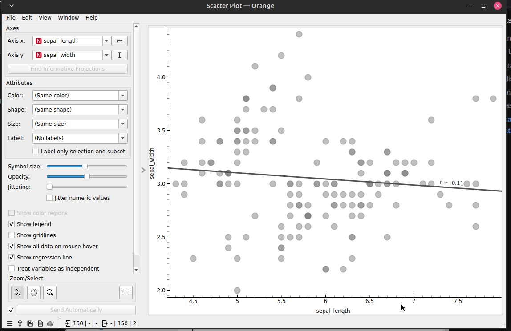
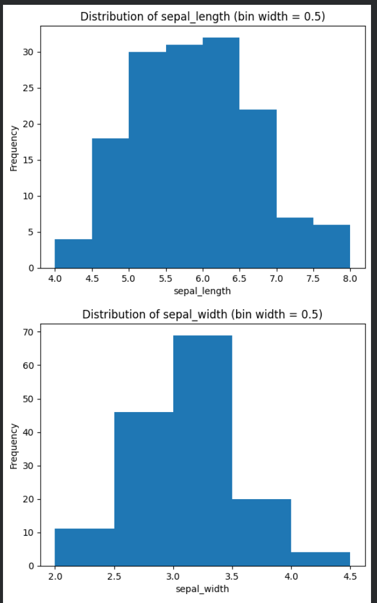
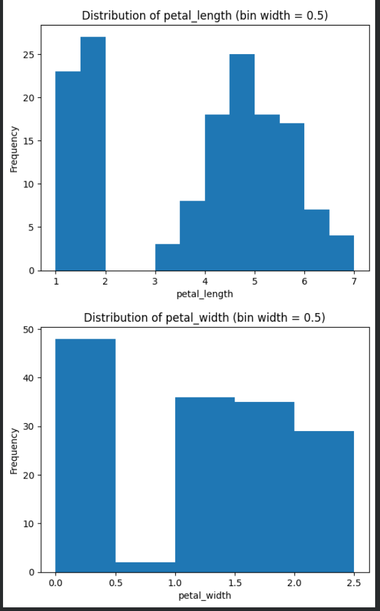
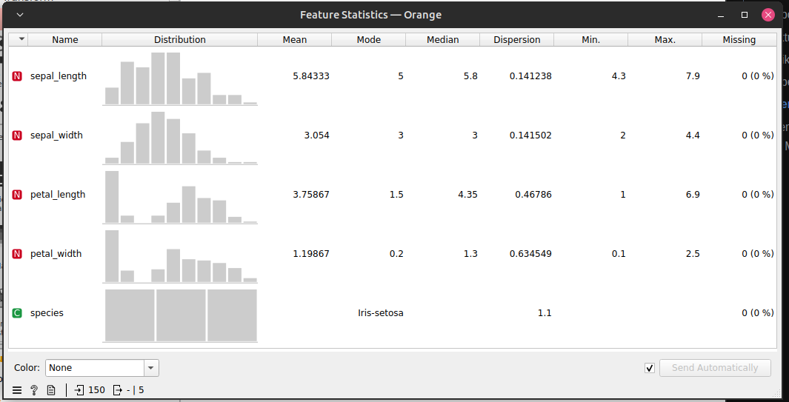
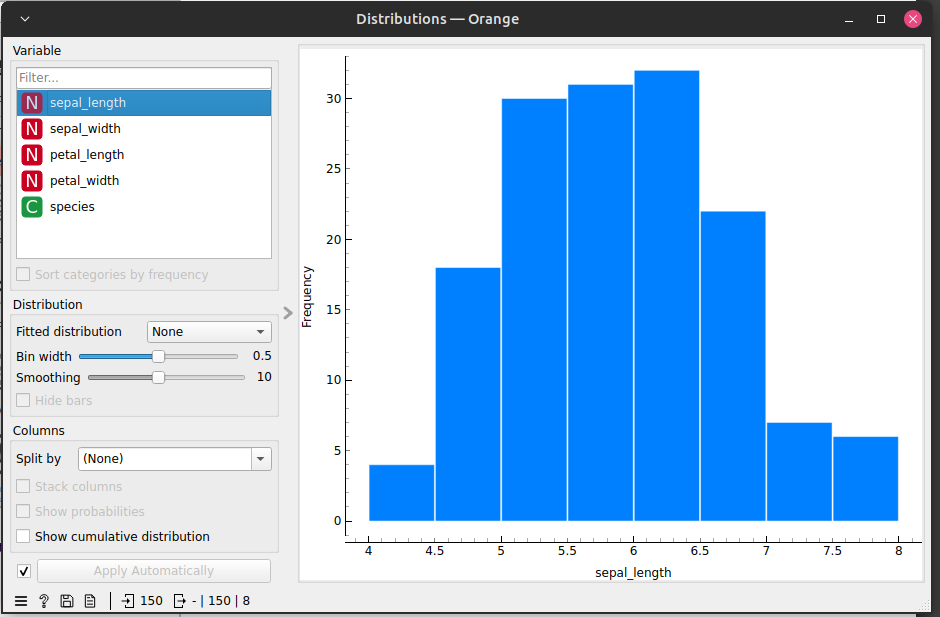
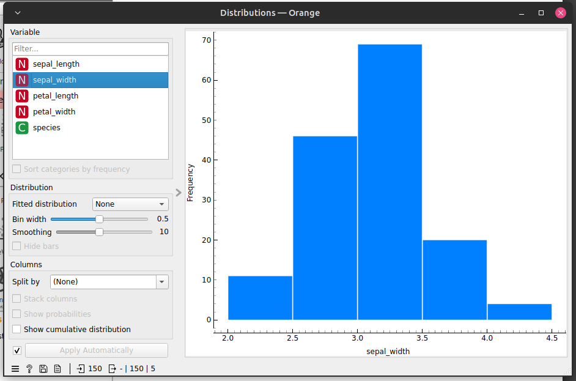
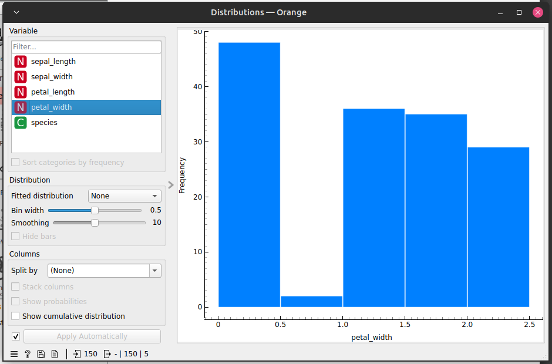

# Data Understanding

Data Understanding merupakan fase eksplorasi awal yang bertujuan mengenali karakteristik dan kondisi data sebelum diproses lebih lanjut. Data dapat berasal dari berbagai format, seperti XML, JSON, maupun basis data relasional. Sebelum analisis dilakukan, data perlu diperiksa dan dibersihkan agar hasil pengolahan dapat diandalkan.

## Konsep Dasar

### Kualitas dan Kebersihan Data

Keberadaan data yang tidak bersih (_dirty data_) dapat menurunkan akurasi hasil analisis. Beberapa masalah umum yang ditemui pada data mentah antara lain:

1. **Redudansi data**: Data yang tercatat lebih dari sekali sehingga menyebabkan duplikasi dalam dataset.
2. **Data tidak konsisten**: Data yang merepresentasikan informasi yang sama namun memiliki format atau nilai yang berbeda-beda.

Penilaian kualitas data dilakukan dengan memeriksa adanya _missing values_ dan baris duplikat. Secara umum, _missing values_ masih dapat ditoleransi apabila jumlahnya di bawah 10 persen dari keseluruhan data.

### Komponen Utama Memahami Data

Proses pemahaman data mencakup empat komponen yang saling berkaitan:

1. **Pengumpulan data awal**: Menghimpun data mentah dari berbagai sumber yang relevan.
2. **Deskripsi data**: Menjabarkan karakteristik umum dari data yang telah dikumpulkan.
3. **Eksplorasi data**: Mengidentifikasi pola dan keterkaitan awal antar variabel melalui statistik maupun visualisasi.
4. **Kualitas data**: Memverifikasi bahwa data telah memenuhi standar kelayakan untuk digunakan dalam pemodelan.

### Struktur Data dan Seleksi Fitur

Data tabular tersusun dalam bentuk baris (record) dan kolom (fitur). Tidak semua kolom yang tersedia diperlukan dalam analisis, sehingga dilakukan seleksi fitur untuk menyisakan hanya variabel yang relevan dan berkontribusi terhadap tujuan pemodelan.

### Teknik Analisis dan Pemodelan

Eksplorasi Data Analisis (EDA) dilakukan untuk memahami struktur dan pola yang tersimpan dalam data. Beberapa teknik yang umum dipakai meliputi:

1. **Regresi Linier**: Memodelkan hubungan antar variabel yang mengikuti pola garis lurus.
2. **Regresi Non Linier**: Memodelkan hubungan antar variabel yang membentuk pola kurva atau tidak beraturan.
3. **Scatter Plot**: Menampilkan sebaran titik data untuk mengamati hubungan dua variabel secara visual.
4. **Histogram**: Menggambarkan sebaran frekuensi nilai dalam interval-interval tertentu.
5. **Outlier**: Nilai ekstrem yang menyimpang jauh dari distribusi umum data.

### Sumber dan Tipe Data

Sumber data dapat bervariasi, mulai dari sistem basis data internal perusahaan, platform media sosial, log aktivitas sistem, hingga kuesioner survei. Adapun tipe data yang lazim dijumpai dalam analisis meliputi:

1. **Biner**: Data dengan dua kemungkinan nilai. Dibedakan menjadi biner simetris, yaitu ketika kedua nilai memiliki bobot yang setara (contoh: jenis kelamin), dan biner asimetris, yaitu ketika satu nilai lebih diutamakan (contoh: hasil tes penyakit).
2. **Kategorikal**: Data yang berisi lebih dari dua pilihan kategori tanpa nilai numerik yang melekat.
3. **Numerik**: Data berupa angka yang diperoleh dari hasil pengukuran atau pencacahan langsung.

## Eksplorasi Data Iris

### Analisa Korelasi

Analisa korelasi bertujuan mengukur tingkat keterkaitan antar fitur numerik dalam dataset. Hasilnya dinyatakan dalam koefisien yang bernilai antara -1 dan 1. Nilai positif menunjukkan bahwa kedua variabel bergerak searah, nilai negatif menunjukkan arah yang berlawanan, dan nilai mendekati nol mengindikasikan tidak adanya hubungan linear yang berarti.

Google Colab:

```python
import pandas as pd

# Load dataset
df = pd.read_csv('iris.csv')  # sesuaikan path jika perlu

# Ambil hanya kolom numerik
df_numeric = df.select_dtypes(include=['number'])

# Hitung korelasi
correlation_matrix = df_numeric.corr()

# Tampilkan tabel korelasi
print(correlation_matrix)
```

|                  | sepal_length | sepal_width | petal_length | petal_width |
| :--------------- | :----------: | :---------: | :----------: | :---------: |
| **sepal_length** |   1.000000   |  -0.109369  |   0.871754   |  0.817954   |
| **sepal_width**  |  -0.109369   |  1.000000   |  -0.420516   |  -0.356544  |
| **petal_length** |   0.871754   |  -0.420516  |   1.000000   |  0.962757   |
| **petal_width**  |   0.817954   |  -0.356544  |   0.962757   |  1.000000   |

_Scatter plot_ digunakan untuk memvisualisasikan hubungan antara dua variabel secara grafis, dengan setiap titik diwarnai berdasarkan spesies sehingga memudahkan pengamatan pengelompokan data.

```python
import pandas as pd
import matplotlib.pyplot as plt

# Load dataset
df = pd.read_csv('iris.csv')  # sesuaikan path jika perlu

# Scatter plot dengan warna berdasarkan species
plt.figure()

for species in df['species'].unique():
    subset = df[df['species'] == species]
    plt.scatter(subset['sepal_length'], subset['sepal_width'], label=species)

plt.xlabel('Sepal Length')
plt.ylabel('Sepal Width')
plt.title('Scatter Plot: Sepal Length vs Sepal Width (by Species)')
plt.legend()

plt.show()
```



Orange:





### Statistik Deskriptif

Statistik deskriptif merangkum karakteristik utama dari setiap fitur numerik dalam satu tabel. Ukuran yang dihitung mencakup _mean_ (rata-rata), _mode_ (nilai terbanyak), _median_ (nilai tengah), nilai terkecil (_min_), nilai terbesar (_max_), serta jumlah data yang kosong (_missing values_).

Google Colab:

```python
import pandas as pd

# Load dataset
df = pd.read_csv('iris.csv')  # sesuaikan path jika perlu

# Ambil hanya kolom numerik
df_numeric = df.select_dtypes(include=['number'])

# Buat tabel statistik deskriptif
descriptive_stats = pd.DataFrame({
    'name': df_numeric.columns,
    'mean': df_numeric.mean().values,
    'mode': df_numeric.mode().iloc[0].values,
    'median': df_numeric.median().values,
    'min': df_numeric.min().values,
    'max': df_numeric.max().values,
    'missing': df_numeric.isnull().sum().values
})

print(descriptive_stats)
```

|     | name         |   mean   | mode | median | min | max | missing |
| :-- | :----------- | :------: | :--: | :----: | :-: | :-: | :-----: |
| 0   | sepal_length | 5.843333 | 5.0  |  5.80  | 4.3 | 7.9 |    0    |
| 1   | sepal_width  | 3.054000 | 3.0  |  3.00  | 2.0 | 4.4 |    0    |
| 2   | petal_length | 3.758667 | 1.5  |  4.35  | 1.0 | 6.9 |    0    |
| 3   | petal_width  | 1.198667 | 0.2  |  1.30  | 0.1 | 2.5 |    0    |

Distribusi setiap fitur kemudian divisualisasikan menggunakan histogram dengan lebar _bin_ sebesar 0,5. Histogram menampilkan frekuensi nilai dalam setiap interval sehingga bentuk sebaran data dapat diamati secara langsung.

```python
import pandas as pd
import matplotlib.pyplot as plt
import numpy as np

# Load dataset
df = pd.read_csv('iris.csv')

# Ambil hanya kolom numerik
df_numeric = df.select_dtypes(include=['number'])

# Loop untuk setiap fitur numerik
for column in df_numeric.columns:
    values = df_numeric[column]

    # Tentukan bin width = 0.5
    bins = np.arange(values.min() - (values.min() % 0.5), values.max() + 0.5, 0.5)

    plt.figure()
    plt.hist(values, bins=bins)

    plt.xlabel(column)
    plt.ylabel("Frequency")
    plt.title(f"Distribution of {column} (bin width = 0.5)")

    plt.show()
```





Orange:

Pada Orange Data Mining, eksplorasi statistik dan visualisasi distribusi dapat dilakukan tanpa menulis kode melalui antarmuka _drag and drop_. Ringkasan statistik tiap fitur ditampilkan oleh widget **Feature Statistics**, sementara sebaran frekuensinya divisualisasikan oleh widget **Distributions**.









