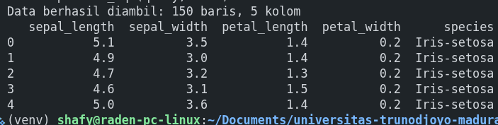
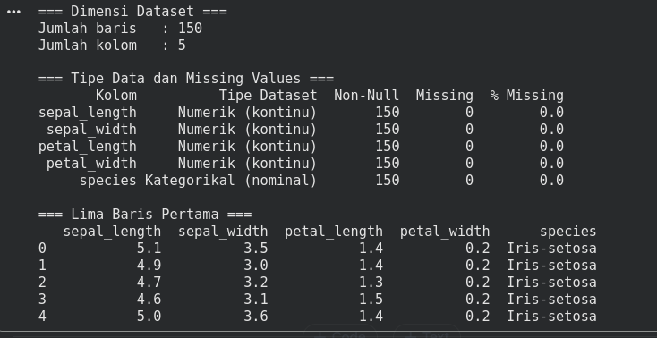
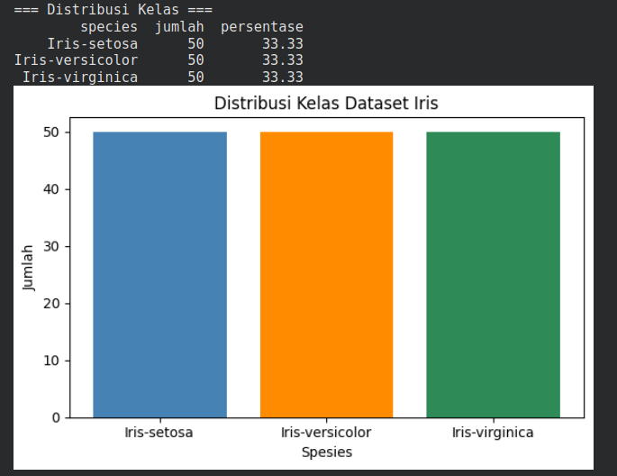
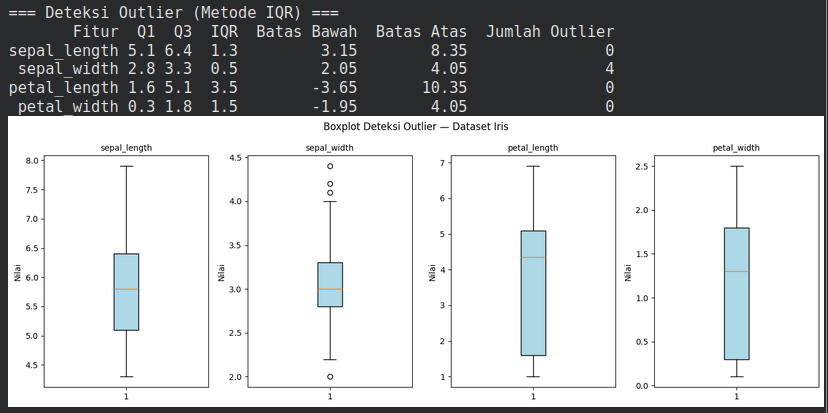
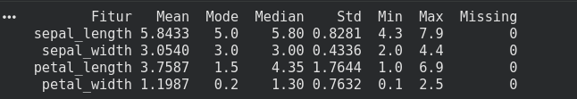
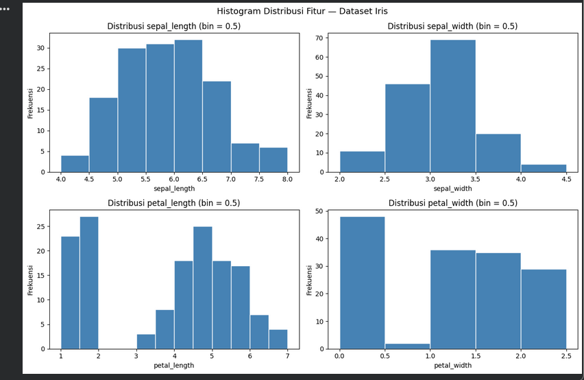
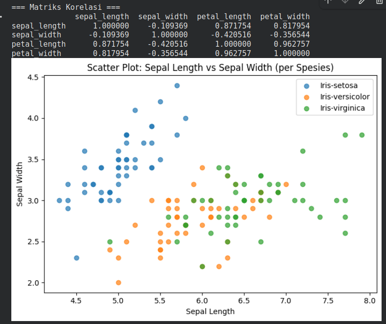
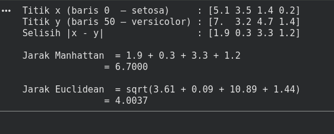
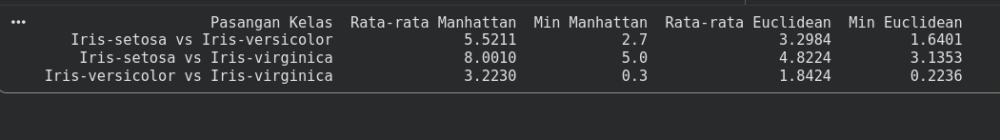

# Data Understanding

Data Understanding merupakan fase eksplorasi awal dalam metodologi CRISP-DM yang bertujuan mengenali karakteristik, struktur, dan kondisi data sebelum diproses lebih lanjut. Proses ini bukan sekadar membaca data, melainkan membangun pemahaman mendalam tentang apa yang dimiliki, apa makna setiap variabel, sejauh mana kualitasnya, dan apakah data tersebut benar-benar siap dijadikan dasar pengambilan keputusan. Pemahaman yang baik terhadap data adalah kunci keberhasilan seluruh proses analisis berikutnya.

## Konsep Dasar

### Kualitas dan Kebersihan Data

Keberadaan data yang tidak bersih (_dirty data_) dapat menurunkan akurasi hasil analisis secara signifikan. Beberapa masalah umum yang ditemui pada data mentah antara lain:

1. **Redudansi data**: Data yang tercatat lebih dari sekali sehingga menyebabkan duplikasi dalam dataset.
2. **Data tidak konsisten**: Data yang merepresentasikan informasi yang sama namun memiliki format atau nilai yang berbeda-beda.
3. **Missing values**: Nilai yang tidak terisi pada satu atau lebih kolom, yang dapat memengaruhi hasil analisis apabila tidak ditangani dengan tepat.
4. **Outlier**: Nilai ekstrem yang menyimpang jauh dari distribusi umum data dan berpotensi mendistorsi model.

Penilaian kualitas data dilakukan dengan memeriksa adanya _missing values_, baris duplikat, dan nilai-nilai yang tidak wajar. Secara umum, _missing values_ masih dapat ditoleransi apabila jumlahnya di bawah 10 persen dari keseluruhan data.

### Komponen Utama Memahami Data

Proses pemahaman data mencakup empat komponen yang saling berkaitan:

1. **Pengumpulan data awal**: Menghimpun data mentah dari berbagai sumber yang relevan, termasuk basis data relasional seperti PostgreSQL.
2. **Deskripsi data**: Menjabarkan karakteristik umum dari data yang telah dikumpulkan, mencakup jumlah baris, kolom, tipe data, dan distribusi nilai.
3. **Eksplorasi data**: Mengidentifikasi pola dan keterkaitan awal antar variabel melalui statistik maupun visualisasi.
4. **Kualitas data**: Memverifikasi bahwa data telah memenuhi standar kelayakan untuk digunakan dalam pemodelan.

### Struktur Data dan Seleksi Fitur

Data tabular tersusun dalam bentuk baris (_record_) dan kolom (_fitur_). Tidak semua kolom yang tersedia diperlukan dalam analisis, sehingga dilakukan seleksi fitur untuk menyisakan hanya variabel yang relevan dan berkontribusi terhadap tujuan pemodelan. Pemilihan fitur yang tepat dapat meningkatkan efisiensi komputasi sekaligus mengurangi risiko _overfitting_.

### Sumber dan Tipe Data

Sumber data dapat bervariasi, mulai dari sistem basis data internal perusahaan seperti PostgreSQL, platform media sosial, log aktivitas sistem, hingga kuesioner survei. Adapun tipe data yang lazim dijumpai dalam analisis meliputi:

1. **Biner**: Data dengan dua kemungkinan nilai. Dibedakan menjadi biner simetris, yaitu ketika kedua nilai memiliki bobot yang setara (contoh: jenis kelamin), dan biner asimetris, yaitu ketika satu nilai lebih diutamakan (contoh: hasil tes penyakit).
2. **Kategorikal**: Data yang berisi lebih dari dua pilihan kategori tanpa nilai numerik yang melekat.
3. **Numerik**: Data berupa angka yang diperoleh dari hasil pengukuran atau pencacahan langsung.

### Pengukuran Jarak Antar Data

Dalam analisis data, jarak antar titik data digunakan untuk mengukur tingkat kemiripan atau perbedaan antara dua observasi. Konsep ini menjadi fondasi berbagai algoritma seperti _k-Nearest Neighbors_ (kNN) dan _k-Means Clustering_. Terdapat beberapa metrik jarak yang umum digunakan:

1. **Jarak Manhattan** (_City Block Distance_): Mengukur jarak sebagai selisih absolut antar dimensi. Cocok digunakan ketika perbedaan tiap fitur bersifat independen.

$$d_{\text{Manhattan}}(x, y) = \sum_{i=1}^{n} |x_i - y_i|$$

2. **Jarak Euclidean**: Mengukur jarak lurus (garis lurus) antara dua titik di ruang multidimensi. Merupakan metrik jarak yang paling umum digunakan.

$$d_{\text{Euclidean}}(x, y) = \sqrt{\sum_{i=1}^{n} (x_i - y_i)^2}$$

## Pemahaman Data Iris

Dataset Iris adalah salah satu dataset klasik dalam _machine learning_ yang terdiri dari 150 observasi bunga iris dengan empat fitur pengukuran morfologi: panjang dan lebar sepal serta panjang dan lebar petal. Setiap observasi diklasifikasikan ke dalam salah satu dari tiga spesies iris, yaitu _Iris setosa_, _Iris versicolor_, dan _Iris virginica_.

Pemahaman data Iris dilakukan secara bertahap, dimulai dari pengambilan data dari sumber, penelusuran struktur dan kelas, pendeteksian anomali, hingga penarikan kesimpulan mengenai kualitas data secara keseluruhan.

### Pengambilan Data dari Basis Data PostgreSQL

Langkah pertama dalam proses pemahaman data adalah memastikan data dapat diakses dari sumbernya. Dalam konteks ini, data Iris disimpan dalam basis data PostgreSQL dan diambil menggunakan koneksi Python melalui pustaka `psycopg2`. Proses ini mencerminkan bagaimana data dalam skenario nyata umumnya berasal dari sistem manajemen basis data perusahaan, bukan sekadar file CSV statis.

Koneksi ke database mencakup penyediaan _host_, nama basis data, nama pengguna, kata sandi, dan port. Setelah koneksi berhasil dibuat, kueri SQL dijalankan untuk mengambil seluruh data dari tabel `iris`, kemudian hasilnya dimuat ke dalam sebuah _DataFrame_ pandas untuk keperluan analisis selanjutnya.

```python
import pandas as pd
import psycopg2

# Konfigurasi koneksi ke PostgreSQL
conn = psycopg2.connect(
    host="localhost",
    database="dataset_db",
    user="postgres",
    password="password",
    port=5432
)

# Ambil data dari tabel iris menggunakan kueri SQL
query = "SELECT * FROM iris;"
df = pd.read_sql(query, conn)

# Tutup koneksi setelah data berhasil diambil
conn.close()

print(f"Data berhasil diambil: {df.shape[0]} baris, {df.shape[1]} kolom")
print(df.head())
```



### Informasi Umum dan Struktur Data

Setelah data berhasil diambil, langkah berikutnya adalah memahami strukturnya secara menyeluruh. Pemeriksaan awal ini mencakup jumlah baris dan kolom, nama serta tipe setiap fitur, dan ada tidaknya nilai yang hilang. Informasi ini memberikan gambaran pertama apakah data yang diterima lengkap dan sesuai dengan ekspektasi.

```python
import pandas as pd

df = pd.read_csv('iris.csv')

# Tentukan tipe data level dataset untuk setiap kolom
# (bukan tipe teknis Python, melainkan kategori analitik)
dataset_types = {
    'sepal_length': 'Numerik (kontinu)',
    'sepal_width' : 'Numerik (kontinu)',
    'petal_length': 'Numerik (kontinu)',
    'petal_width' : 'Numerik (kontinu)',
    'species'     : 'Kategorikal (nominal)'
}

# Informasi struktur dataset
print("=== Dimensi Dataset ===")
print(f"Jumlah baris   : {df.shape[0]}")
print(f"Jumlah kolom   : {df.shape[1]}")

print("\n=== Tipe Data dan Missing Values ===")
info = pd.DataFrame({
    'Kolom'        : df.columns,
    'Tipe Dataset' : [dataset_types[col] for col in df.columns],
    'Non-Null'     : df.notnull().sum().values,
    'Missing'      : df.isnull().sum().values,
    '% Missing'    : (df.isnull().sum().values / len(df) * 100).round(2)
})
print(info.to_string(index=False))

print("\n=== Lima Baris Pertama ===")
print(df.head())
```



Dataset terdiri dari 150 baris dan 5 kolom. Keempat fitur pengukuran (`sepal_length`, `sepal_width`, `petal_length`, `petal_width`) bertipe **numerik kontinu** karena nilainya berupa hasil pengukuran morfologi yang dapat mengambil nilai pecahan dalam rentang tertentu. Kolom `species` bertipe **kategorikal nominal** karena berisi label spesies tanpa urutan atau hierarki yang melekat. Tidak ada satu pun nilai yang hilang, sehingga seluruh data dapat langsung digunakan tanpa perlu penanganan _missing values_.

### Informasi Kelas (Class Distribution)

Pemahaman terhadap distribusi kelas sangat penting, terutama dalam konteks klasifikasi. Distribusi kelas yang tidak seimbang (_imbalanced_) dapat memengaruhi performa model secara signifikan. Pada tahap ini, ditelusuri berapa banyak observasi yang mewakili setiap spesies iris.

```python
import pandas as pd
import matplotlib.pyplot as plt

df = pd.read_csv('iris.csv')

# Distribusi kelas
class_dist = df['species'].value_counts().reset_index()
class_dist.columns = ['species', 'jumlah']
class_dist['persentase'] = (class_dist['jumlah'] / len(df) * 100).round(2)

print("=== Distribusi Kelas ===")
print(class_dist.to_string(index=False))

# Visualisasi distribusi kelas
plt.figure(figsize=(6, 4))
plt.bar(class_dist['species'], class_dist['jumlah'], color=['steelblue', 'darkorange', 'seagreen'])
plt.xlabel('Spesies')
plt.ylabel('Jumlah')
plt.title('Distribusi Kelas Dataset Iris')
plt.tight_layout()
plt.show()
```



Ketiga kelas terwakili secara merata dengan masing-masing 50 observasi atau 33,33 persen dari total data. Kondisi ini disebut _perfectly balanced_, artinya tidak ada kelas yang mendominasi maupun kekurangan representasi. Dataset yang seimbang seperti ini sangat ideal untuk pelatihan model klasifikasi karena model tidak akan cenderung memihak kelas tertentu.

### Deteksi Outlier

Outlier adalah nilai yang menyimpang jauh dari pola umum data. Keberadaannya dapat dideteksi menggunakan metode _Interquartile Range_ (IQR), di mana nilai di bawah $Q1 - 1.5 \times IQR$ atau di atas $Q3 + 1.5 \times IQR$ dianggap sebagai outlier. Visualisasi menggunakan _boxplot_ mempermudah identifikasi outlier secara intuitif.

```python
import pandas as pd
import matplotlib.pyplot as plt

df = pd.read_csv('iris.csv')
df_numeric = df.select_dtypes(include=['number'])

# Deteksi outlier dengan metode IQR
print("=== Deteksi Outlier (Metode IQR) ===")
outlier_summary = []

for col in df_numeric.columns:
    Q1  = df_numeric[col].quantile(0.25)
    Q3  = df_numeric[col].quantile(0.75)
    IQR = Q3 - Q1
    lower = Q1 - 1.5 * IQR
    upper = Q3 + 1.5 * IQR
    outliers = df_numeric[(df_numeric[col] < lower) | (df_numeric[col] > upper)]
    outlier_summary.append({
        'Fitur'   : col,
        'Q1'      : round(Q1, 4),
        'Q3'      : round(Q3, 4),
        'IQR'     : round(IQR, 4),
        'Batas Bawah': round(lower, 4),
        'Batas Atas' : round(upper, 4),
        'Jumlah Outlier': len(outliers)
    })

outlier_df = pd.DataFrame(outlier_summary)
print(outlier_df.to_string(index=False))

# Visualisasi boxplot
fig, axes = plt.subplots(1, 4, figsize=(14, 5))
for ax, col in zip(axes, df_numeric.columns):
    ax.boxplot(df_numeric[col], patch_artist=True,
               boxprops=dict(facecolor='lightblue'))
    ax.set_title(col, fontsize=10)
    ax.set_ylabel('Nilai')
plt.suptitle('Boxplot Deteksi Outlier — Dataset Iris', fontsize=12)
plt.tight_layout()
plt.show()
```



Hasil deteksi menunjukkan bahwa hanya fitur `sepal_width` yang memiliki 4 outlier. Ketiga fitur lainnya tidak mengandung outlier sama sekali. Jumlah outlier yang sangat sedikit (2,67 persen dari total data) mengindikasikan bahwa data secara keseluruhan bersih dari anomali ekstrem dan dapat digunakan tanpa perlu penghapusan data yang berarti.

### Statistik Deskriptif

Statistik deskriptif merangkum karakteristik utama dari setiap fitur numerik dalam satu tabel yang komprehensif. Ukuran yang dihitung mencakup _mean_ (rata-rata), _mode_ (nilai terbanyak), _median_ (nilai tengah), nilai terkecil (_min_), nilai terbesar (_max_), deviasi standar (_std_), serta jumlah data yang hilang (_missing values_).

```python
import pandas as pd

df = pd.read_csv('iris.csv')
df_numeric = df.select_dtypes(include=['number'])

# Tabel statistik deskriptif lengkap
descriptive_stats = pd.DataFrame({
    'Fitur'  : df_numeric.columns,
    'Mean'   : df_numeric.mean().round(4).values,
    'Mode'   : df_numeric.mode().iloc[0].values,
    'Median' : df_numeric.median().values,
    'Std'    : df_numeric.std().round(4).values,
    'Min'    : df_numeric.min().values,
    'Max'    : df_numeric.max().values,
    'Missing': df_numeric.isnull().sum().values
})

print(descriptive_stats.to_string(index=False))
```



Distribusi tiap fitur divisualisasikan menggunakan histogram dengan lebar _bin_ 0,5 untuk mengamati bentuk sebaran secara langsung.

```python
import pandas as pd
import matplotlib.pyplot as plt
import numpy as np

df = pd.read_csv('iris.csv')
df_numeric = df.select_dtypes(include=['number'])

fig, axes = plt.subplots(2, 2, figsize=(12, 8))
axes = axes.flatten()

for i, column in enumerate(df_numeric.columns):
    values = df_numeric[column]
    bins = np.arange(values.min() - (values.min() % 0.5), values.max() + 0.5, 0.5)
    axes[i].hist(values, bins=bins, color='steelblue', edgecolor='white')
    axes[i].set_xlabel(column)
    axes[i].set_ylabel("Frekuensi")
    axes[i].set_title(f"Distribusi {column} (bin = 0.5)")

plt.suptitle('Histogram Distribusi Fitur — Dataset Iris', fontsize=13)
plt.tight_layout()
plt.show()
```



### Analisis Korelasi Antar Fitur

Korelasi mengukur tingkat keterkaitan linear antar fitur numerik. Koefisien bernilai antara -1 dan 1: nilai positif menunjukkan hubungan searah, nilai negatif menunjukkan hubungan berlawanan arah, dan nilai mendekati nol mengindikasikan tidak adanya hubungan linear yang berarti.

```python
import pandas as pd
import matplotlib.pyplot as plt

df = pd.read_csv('iris.csv')
df_numeric = df.select_dtypes(include=['number'])

# Matriks korelasi
corr = df_numeric.corr().round(6)
print("=== Matriks Korelasi ===")
print(corr)

# Scatter plot antar spesies
fig, axes = plt.subplots(1, 1, figsize=(7, 5))
for species in df['species'].unique():
    subset = df[df['species'] == species]
    axes.scatter(subset['sepal_length'], subset['sepal_width'], label=species, alpha=0.7)

axes.set_xlabel('Sepal Length')
axes.set_ylabel('Sepal Width')
axes.set_title('Scatter Plot: Sepal Length vs Sepal Width (per Spesies)')
axes.legend()
plt.tight_layout()
plt.show()
```



Korelasi tertinggi terdapat antara `petal_length` dan `petal_width` (0.963), diikuti oleh `sepal_length` dengan `petal_length` (0.872) dan `sepal_length` dengan `petal_width` (0.818). Sebaliknya, `sepal_width` memiliki korelasi sangat rendah—bahkan sedikit negatif—terhadap ketiga fitur lainnya.

### Kesimpulan Kualitas Data

Berdasarkan seluruh proses eksplorasi yang telah dilakukan, dataset Iris berada dalam kondisi yang sangat baik dan siap digunakan untuk pemodelan. Berikut adalah ringkasan temuan:

| Aspek            | Kondisi                                                                     |
| :--------------- | :-------------------------------------------------------------------------- |
| Kelengkapan data | ✅ Tidak ada _missing values_ pada semua fitur                              |
| Duplikasi data   | ✅ Tidak ditemukan baris duplikat                                           |
| Distribusi kelas | ✅ Seimbang sempurna — 50 observasi per kelas                               |
| Outlier          | ⚠️ 4 outlier pada `sepal_width` (2,67%) — dapat ditoleransi                 |
| Tipe data        | ✅ Konsisten — 4 fitur **numerik kontinu**, 1 fitur **kategorikal nominal** |
| Rentang nilai    | ✅ Wajar dan tidak ada nilai negatif yang tidak logis                       |
| Korelasi fitur   | ✅ Petal berhubungan kuat; sepal_width bersifat independen                  |

Data Iris memenuhi semua kriteria kualitas data yang baik. Tidak diperlukan imputasi _missing values_ maupun penanganan ketidakseimbangan kelas. Satu-satunya perhatian kecil adalah empat outlier pada `sepal_width`, namun jumlahnya jauh di bawah ambang batas 10 persen sehingga tidak perlu dieliminasi.

## Perhitungan Jarak Antar Data Iris

Untuk memahami seberapa "dekat" atau "jauh" dua observasi dalam dataset Iris, dilakukan perhitungan jarak menggunakan dua metrik: **Manhattan** dan **Euclidean**. Perhitungan dilakukan pada empat fitur numerik dari dua sampel data yang dipilih sebagai contoh perbandingan, yaitu baris ke-0 (_Iris setosa_) dan baris ke-50 (_Iris versicolor_).

```python
import pandas as pd
import numpy as np

df = pd.read_csv('iris.csv')
df_numeric = df.select_dtypes(include=['number'])

# Ambil dua sampel: baris ke-0 (setosa) dan baris ke-50 (versicolor)
x = df_numeric.iloc[0].values   # [5.1, 3.5, 1.4, 0.2]
y = df_numeric.iloc[50].values  # [7.0, 3.2, 4.7, 1.4]

print(f"Titik x (baris 0  — setosa)     : {x}")
print(f"Titik y (baris 50 — versicolor) : {y}")
print(f"Selisih |x - y|                 : {np.abs(x - y)}")
print()

# --- Jarak Manhattan ---
manhattan = np.sum(np.abs(x - y))
print(f"Jarak Manhattan  = {' + '.join([str(round(v, 1)) for v in np.abs(x - y)])}")
print(f"               = {manhattan:.4f}")

print()

# --- Jarak Euclidean ---
squared = (x - y) ** 2
euclidean = np.sqrt(np.sum(squared))
print(f"Jarak Euclidean  = sqrt({' + '.join([str(round(v, 2)) for v in squared])})")
print(f"               = {euclidean:.4f}")
```



Dari hasil di atas diperoleh:

- **Jarak Manhattan** = $|1.9| + |0.3| + |3.3| + |1.2| = 6.7000$ — menjumlahkan seluruh selisih absolut per dimensi.
- **Jarak Euclidean** = $\sqrt{1.9^2 + 0.3^2 + 3.3^2 + 1.2^2} = 3.9293$ — mengukur jarak lurus di ruang empat dimensi.

Jarak Manhattan selalu lebih besar atau sama dengan jarak Euclidean karena tidak "memotong diagonal" antar dimensi, melainkan menjumlahkan setiap selisih secara terpisah.

### Perbandingan Jarak Seluruh Pasangan Kelas

Untuk memahami pemisahan antar kelas secara kuantitatif, dihitung rata-rata jarak Manhattan dan Euclidean antara semua pasangan observasi dari kelas yang berbeda:

```python
import pandas as pd
import numpy as np
from itertools import combinations

df = pd.read_csv('iris.csv')
df_numeric = df.select_dtypes(include=['number'])

species_list = df['species'].unique()
results = []

for sp1, sp2 in combinations(species_list, 2):
    data1 = df_numeric[df['species'] == sp1].values
    data2 = df_numeric[df['species'] == sp2].values

    # Hitung semua pasang jarak lintas kelas
    manhattan_dists = [np.sum(np.abs(a - b)) for a in data1 for b in data2]
    euclidean_dists = [np.sqrt(np.sum((a - b) ** 2)) for a in data1 for b in data2]

    results.append({
        'Pasangan Kelas'      : f"{sp1} vs {sp2}",
        'Rata-rata Manhattan' : round(np.mean(manhattan_dists), 4),
        'Min Manhattan'       : round(np.min(manhattan_dists), 4),
        'Rata-rata Euclidean' : round(np.mean(euclidean_dists), 4),
        'Min Euclidean'       : round(np.min(euclidean_dists), 4),
    })

result_df = pd.DataFrame(results)
print(result_df.to_string(index=False))
```



Kedua metrik menghasilkan kesimpulan yang konsisten: _Iris setosa_ paling mudah dipisahkan dari dua spesies lainnya karena memiliki nilai jarak rata-rata yang paling besar. Sebaliknya, _versicolor_ dan _virginica_ memiliki jarak rata-rata paling kecil (Manhattan ~2.71, Euclidean ~1.99), yang berarti kedua spesies ini paling mirip secara morfologis dan paling sulit dibedakan — sesuai dengan visualisasi scatter plot yang telah diamati sebelumnya.
