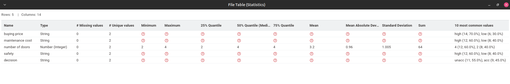
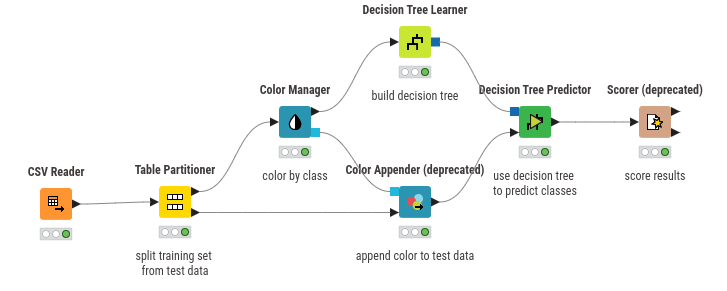
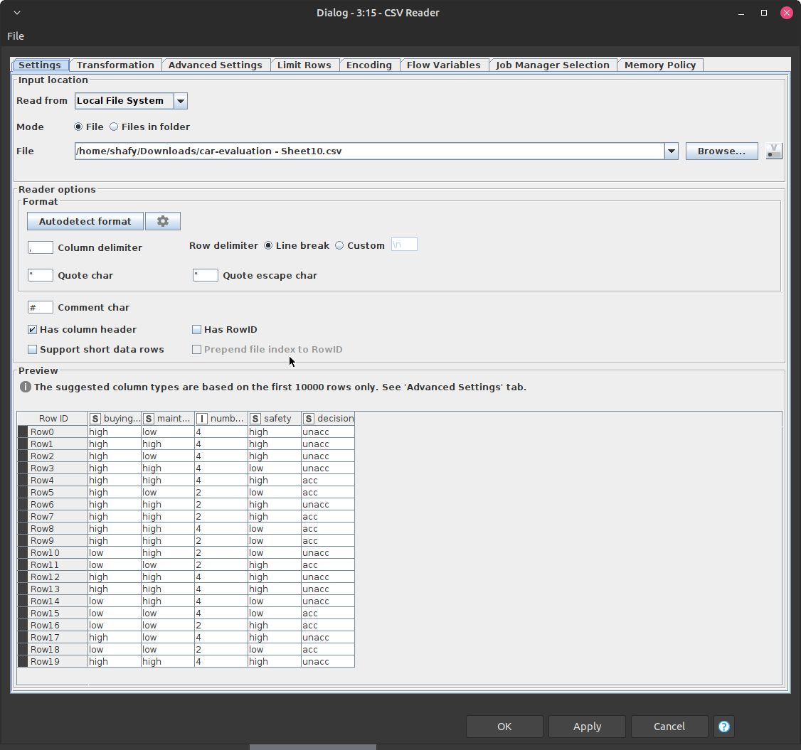
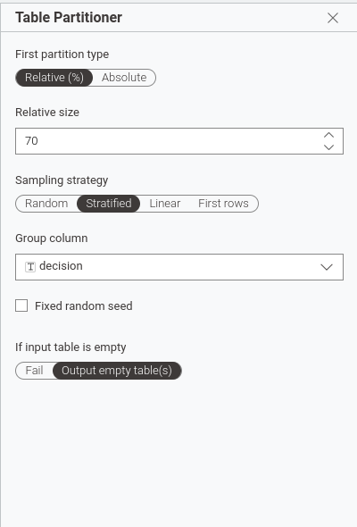
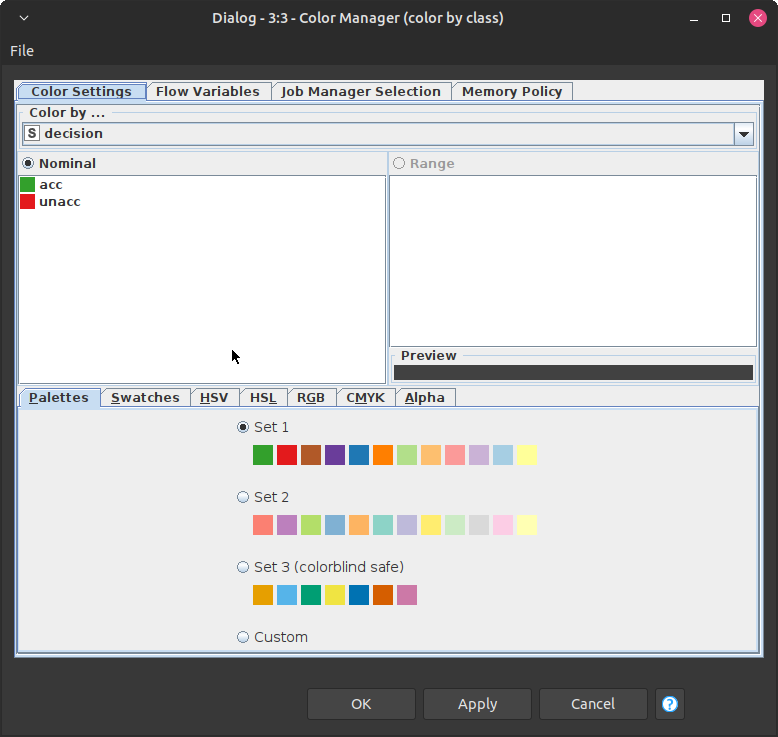
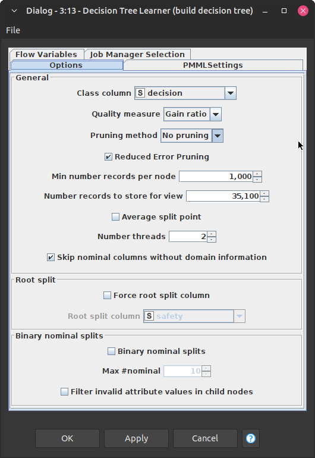
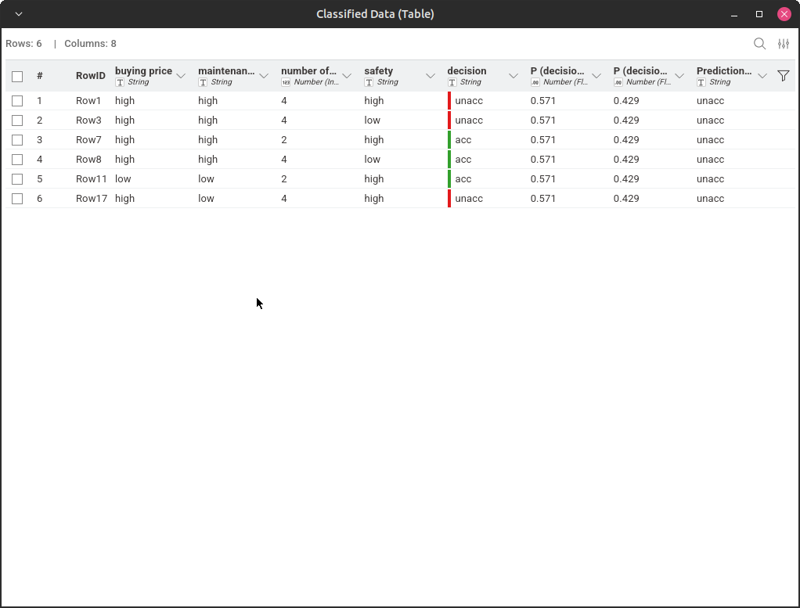
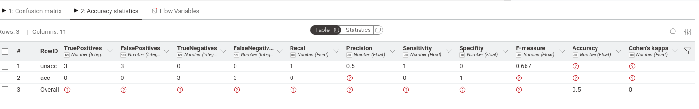

# Tugas Decision Tree

## Analisis Data: Pohon Keputusan (Decision Tree)

### 1. Konsep Dasar Pohon Keputusan

Pohon Keputusan adalah salah satu metode klasifikasi yang paling populer karena mudah diinterpretasikan oleh manusia. Strukturnya menyerupai diagram alur atau pohon terbalik, yang terdiri dari tiga komponen utama:

- **Node Akar (Root Node):** Mewakili seluruh kumpulan data dan merupakan pertanyaan atau atribut pertama yang membagi data.
- **Node Internal (Internal Node):** Mewakili fitur atau atribut yang sedang diuji. Setiap cabang dari node ini menunjukkan hasil dari pengujian tersebut.
- **Node Daun (Leaf Node):** Merupakan hasil akhir atau label kelas (keputusan). Di titik ini, data tidak bisa dibagi lagi.

Secara sederhana, algoritma ini bekerja dengan cara **"divide and conquer"**, yakni memecah data menjadi kelompok yang lebih kecil berdasarkan aturan IF-THEN hingga mencapai sebuah kesimpulan.

---

### 2. Membangun Pohon dengan Gain Ratio

Dalam membangun pohon keputusan, kita harus memilih atribut mana yang paling efektif untuk dijadikan pemecah (splitter) di setiap percabangan. Salah satu ukuran yang digunakan adalah **Gain Ratio**.

#### Mengapa menggunakan Gain Ratio?

Gain Ratio merupakan pengembangan dari _Information Gain_. Masalah pada _Information Gain_ biasa adalah kecenderungannya untuk memilih atribut yang memiliki banyak variasi nilai (misalnya: ID Pelanggan atau Tanggal), padahal atribut tersebut belum tentu berguna untuk prediksi. Gain Ratio hadir untuk "menghukum" atribut-atribut yang memiliki terlalu banyak cabang tersebut agar hasil model lebih objektif.

#### Cara Kerja Gain Ratio

Gain Ratio dihitung dengan membagi dua komponen utama:

1. **Information Gain:** Mengukur seberapa besar penurunan kekacauan (entropi) dalam data setelah dibagi berdasarkan suatu atribut. Semakin tinggi nilai Gain, semakin baik atribut tersebut dalam memisahkan kelas.
2. **Split Information:** Mengukur seberapa lebar dan seragam data terbagi. Jika suatu atribut membagi data menjadi banyak kelompok kecil, nilai _Split Info_ akan tinggi.

**Rumus Sederhana:**

$$\text{Gain Ratio} = \frac{\text{Information Gain}}{\text{Split Information}}$$

**Kesimpulan:**
Atribut dengan nilai **Gain Ratio tertinggi** akan dipilih sebagai node pemecah. Dengan metode ini, Pohon Keputusan yang dihasilkan akan lebih efisien dan terhindar dari bias terhadap atribut yang memiliki terlalu banyak nilai unik.

## Implementasi

### Data Understanding

Pada implementasi ini saya menggunakan dataset Car Evaluation dari Kaggle. Berikut datanya

| buying price | maintenance cost | number of doors | safety | decision |
| ------------ | ---------------- | --------------- | ------ | -------- |
| high         | low              | 4               | high   | unacc    |
| high         | high             | 4               | high   | unacc    |
| high         | low              | 4               | high   | unacc    |
| high         | high             | 4               | low    | unacc    |
| high         | high             | 4               | high   | acc      |
| high         | low              | 2               | low    | acc      |
| high         | high             | 2               | high   | unacc    |
| high         | high             | 2               | high   | acc      |
| high         | high             | 4               | low    | acc      |
| high         | high             | 2               | low    | acc      |
| low          | high             | 2               | low    | unacc    |
| low          | low              | 2               | high   | acc      |
| high         | high             | 4               | high   | unacc    |
| high         | high             | 4               | high   | unacc    |
| low          | high             | 4               | low    | unacc    |
| low          | low              | 4               | low    | acc      |
| low          | low              | 2               | high   | acc      |
| high         | low              | 4               | high   | unacc    |
| low          | low              | 2               | low    | acc      |
| high         | high             | 4               | high   | unacc    |

#### Struktur & Tipe Data Kolom

| Kolom             | Tipe Data            | Deskripsi                  | Nilai Unik |
| ----------------- | -------------------- | -------------------------- | ---------- |
| buying price      | Kategorikal (String) | Harga beli mobil           | high, low  |
| maintenance cost  | Kategorikal (String) | Biaya perawatan            | high, low  |
| number of doors   | Kategorikal (String) | Jumlah pintu               | 2, 4       |
| safety            | Kategorikal (String) | Tingkat keselamatan        | low, high  |
| decision (Target) | Kategorikal (String) | Label kelas hasil evaluasi | unacc, acc |

#### Target Variable: decision

| Nilai | Arti                                  |
| ----- | ------------------------------------- |
| unacc | Unacceptable (Tidak direkomendasikan) |
| acc   | Acceptable (Dapat diterima)           |

#### Statistik Singkat

### Workflow KNIME

### Detail Node & Konfigurasi

#### CSV Reader Node

Membaca file CSV dan mengubahnya menjadi tabel KNIME untuk diproses node berikutnya.

#### Table Partitioner Node

Membagi dataset menjadi dua bagian: 70% untuk pelatihan (training) dan 30% untuk pengujian (testing). Pembagian ini penting untuk mengevaluasi kinerja model pada data yang belum pernah dilihat sebelumnya.

#### Color Manager Node

Node ini digunakan untuk memberikan warna pada data berdasarkan nilai target (decision). Hal ini memudahkan visualisasi dan analisis data selama proses pelatihan model.

#### Decision Tree Learner Node

Node ini digunakan untuk melatih model pohon keputusan menggunakan data pelatihan. Konfigurasi utama yang perlu diperhatikan adalah pemilihan class column (decision) dan metode pemilihan atribut (Gain Ratio). Pada contoh ini saya tidak menggunakan metode pruning untuk menyederhanakan pohon.

#### Decision Tree Predictor Node

Node ini digunakan untuk menerapkan model pohon keputusan yang telah dilatih pada data pengujian. Node ini akan menghasilkan prediksi kelas (decision) berdasarkan fitur-fitur input dari data pengujian.

#### Scorer Node

Node ini digunakan untuk mengevaluasi kinerja model dengan membandingkan prediksi yang dihasilkan oleh Decision Tree Predictor dengan label sebenarnya (decision) dari data pengujian. Hasil evaluasi berupa metrik seperti akurasi, precision, recall, dan F1-score.

