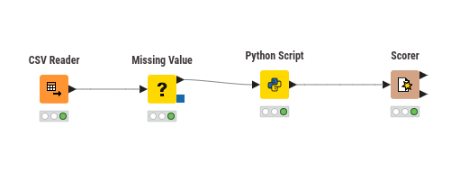
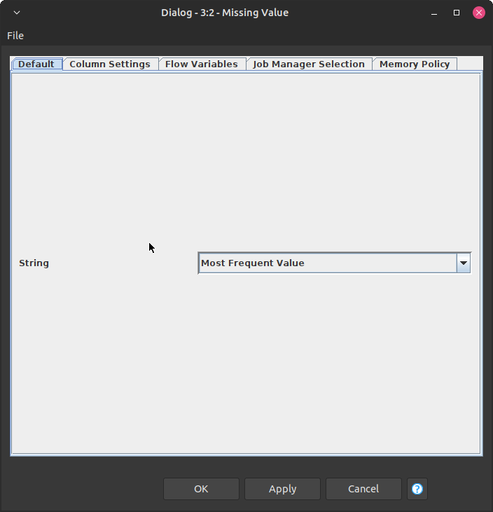
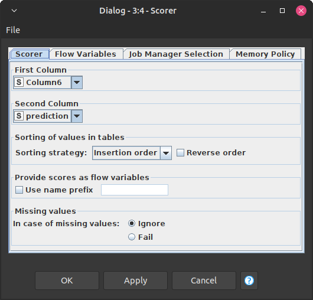
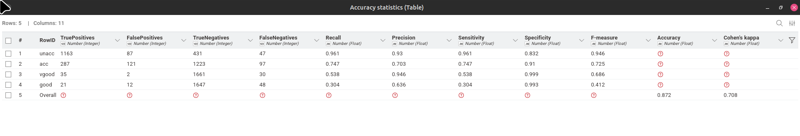

# Tugas Naive Bayes

## Data Understanding

### Deskripsi Dataset

Dataset Car Evaluation berasal dari Kaggle. Dataset ini digunakan untuk memprediksi keputusan penerimaan mobil (decision) berdasarkan enam atribut fitur.

### Struktur & Tipe Data Kolom

| Kolom             | Tipe Data            | Deskripsi                  | Nilai Unik              |
| ----------------- | -------------------- | -------------------------- | ----------------------- |
| buying price      | Kategorikal (String) | Harga beli mobil           | vhigh, high, med, low   |
| maintenance cost  | Kategorikal (String) | Biaya perawatan            | vhigh, high, med, low   |
| number of doors   | Kategorikal (String) | Jumlah pintu               | 2, 3, 4, 5more          |
| number of persons | Kategorikal (String) | Kapasitas penumpang        | 2, 4, more              |
| lug_boot          | Kategorikal (String) | lug_boot                   | small, med, big         |
| safety            | Kategorikal (String) | Tingkat keselamatan        | low, med, high          |
| decision (Target) | Kategorikal (String) | Label kelas hasil evaluasi | unacc, acc, good, vgood |

### Target Variable: decision

| Nilai | Arti                                  |
| ----- | ------------------------------------- |
| unacc | Unacceptable (Tidak direkomendasikan) |
| acc   | Acceptable (Dapat diterima)           |
| good  | Good (Baik)                           |
| vgood | Very Good (Sangat baik)               |

### Statistik Singkat


## Workflow KNIME



## Detail Node & Konfigurasi

### CSV Reader Node

Membaca file CSV dan mengubahnya menjadi tabel KNIME untuk diproses node berikutnya.

### Missing Value Node

Menangani data yang tidak lengkap (missing values) agar tidak menyebabkan error saat training model. Saya menggunakan strategi "Most Frequent Value" untuk mengisi nilai yang hilang dengan nilai yang paling sering muncul di kolom tersebut.



### Python Script Node

Library yang digunakan

```python
import knime.scripting.io as knio
from sklearn.naive_bayes import CategoricalNB
from sklearn.preprocessing import LabelEncoder
```

Script Python

```python
# 1. BACA DATA INPUT
df = knio.input_tables[0].to_pandas()
# Mengambil tabel dari KNIME dan konversi ke DataFrame pandas

# 2. DEFINISI KOLOM
target_col = 'Column6'  # Nama kolom target Anda
feature_cols = [col for col in df.columns if col != target_col]
# Memisahkan kolom fitur dan target secara otomatis

# 3. ENCODE FITUR (Label Encoding)
X = df[feature_cols].copy()
for col in feature_cols:
    le = LabelEncoder()
    X[col] = le.fit_transform(X[col].astype(str))
# Mengubah nilai kategorikal (vhigh, low, dll) menjadi angka (0,1,2,...)
# .astype(str) memastikan semua nilai bisa di-encode dengan aman

# 4. ENCODE TARGET
target_le = LabelEncoder()
y = target_le.fit_transform(df[target_col].astype(str))
# Target juga di-encode agar bisa diproses model

# 5. TRAIN MODEL CATEGORICAL NAIVE BAYES
model = CategoricalNB()
model.fit(X.values, y)
# CategoricalNB cocok untuk data kategorikal diskrit
# Model belajar pola hubungan fitur -> target

# 6. PREDIKSI
predictions = model.predict(X.values)
df['prediction'] = target_le.inverse_transform(predictions)
# Prediksi dikembalikan ke label asli (unacc/acc/good/vgood)

# 7. OUTPUT KE KNIME
output_cols = feature_cols + [target_col, 'prediction']
knio.output_tables[0] = knio.Table.from_pandas(df[output_cols])
# Mengirim hasil kembali ke KNIME untuk evaluasi di Scorer node
```

- Melakukan encoding data kategorikal → numerik
- Melatih model Categorical Naive Bayes
- Melakukan prediksi pada data yang sama (atau bisa dimodifikasi untuk data test)
- Mengembalikan hasil prediksi ke KNIME dalam format tabel

### Scorer Node

Mengevaluasi performa model dengan membandingkan prediksi vs label asli.



## Evaluasi Model

Setelah workflow dijalankan, Scorer node akan menghasilkan:


