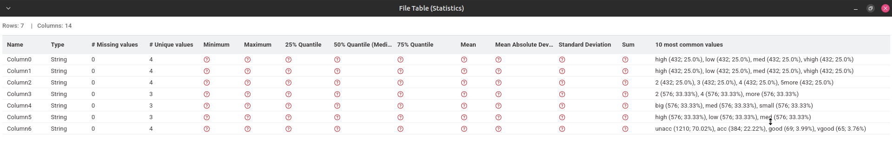
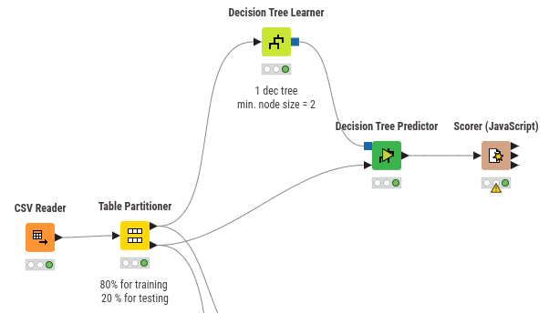
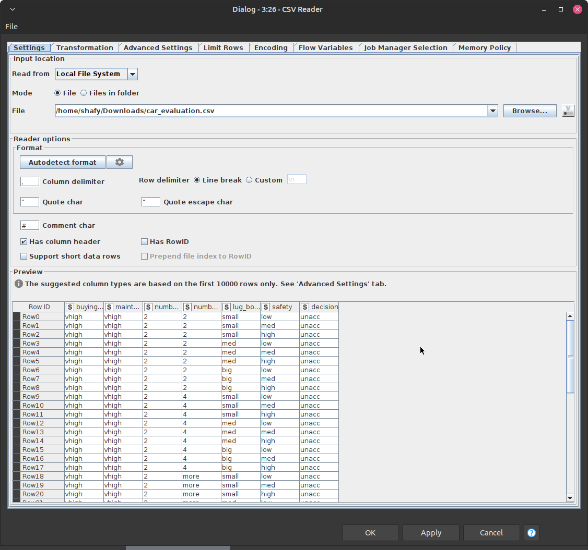
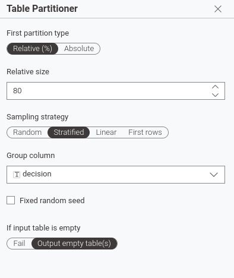
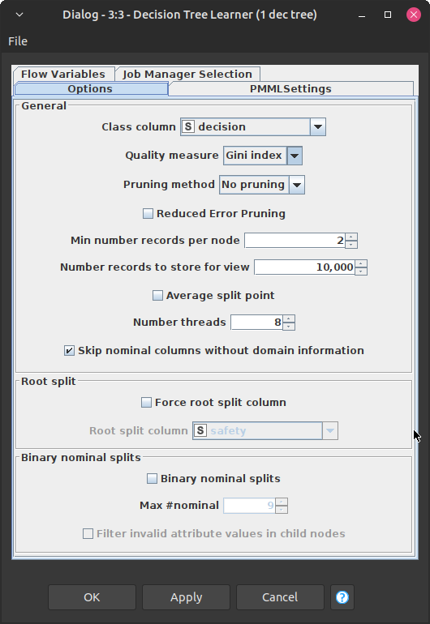
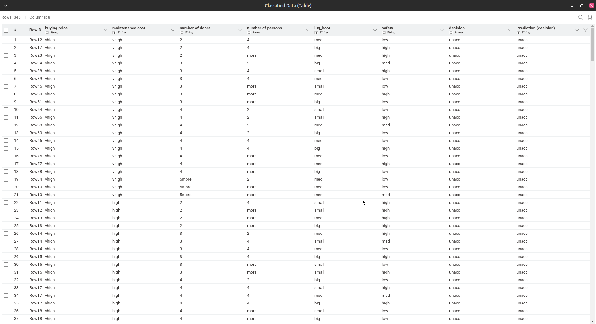
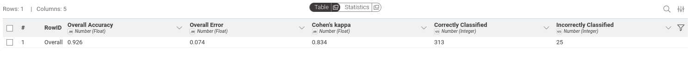
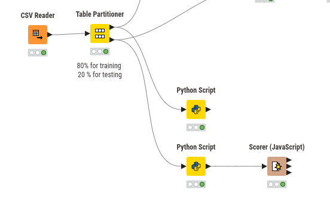
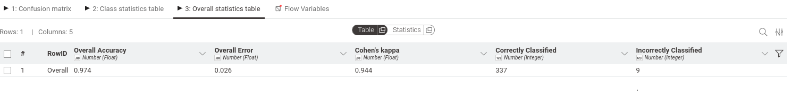

# Tugas Random Forest

## Data Understanding

### Deskripsi Dataset

Dataset Car Evaluation berasal dari Kaggle. Dataset ini digunakan untuk memprediksi keputusan penerimaan mobil (decision) berdasarkan enam atribut fitur.

### Struktur & Tipe Data Kolom

| Kolom             | Tipe Data            | Deskripsi                  | Nilai Unik              |
| ----------------- | -------------------- | -------------------------- | ----------------------- |
| buying price      | Kategorikal (String) | Harga beli mobil           | vhigh, high, med, low   |
| maintenance cost  | Kategorikal (String) | Biaya perawatan            | vhigh, high, med, low   |
| number of doors   | Kategorikal (String) | Jumlah pintu               | 2, 3, 4, 5more          |
| number of persons | Kategorikal (String) | Kapasitas penumpang        | 2, 4, more              |
| lug_boot          | Kategorikal (String) | lug_boot                   | small, med, big         |
| safety            | Kategorikal (String) | Tingkat keselamatan        | low, med, high          |
| decision (Target) | Kategorikal (String) | Label kelas hasil evaluasi | unacc, acc, good, vgood |

### Target Variable: decision

| Nilai | Arti                                  |
| ----- | ------------------------------------- |
| unacc | Unacceptable (Tidak direkomendasikan) |
| acc   | Acceptable (Dapat diterima)           |
| good  | Good (Baik)                           |
| vgood | Very Good (Sangat baik)               |

### Statistik Singkat



## Exploratory Data Analysis (EDA)

### Distribusi Target Variable

Dataset Car Evaluation terdiri dari **1.728 instance** dengan distribusi kelas sebagai berikut:

| Kelas | Jumlah Instance | Persentase |
| ----- | --------------- | ---------- |
| unacc | 1.210           | 70.02%     |
| acc   | 384             | 22.22%     |
| good  | 69              | 3.99%      |
| vgood | 65              | 3.76%      |

**Observasi:**

- Dataset mengalami **ketidakseimbangan kelas (class imbalance)** yang signifikan, di mana kelas `unacc` mendominasi lebih dari 2/3 dari seluruh data
- Kelas `good` dan `vgood` merupakan kelas minoritas dengan total hanya ~7.75% dari dataset
- Ketidakseimbangan ini wajar dalam konteks evaluasi mobil: standar kualitas yang ketat membuat hanya sedikit mobil yang memenuhi kriteria "baik" atau "sangat baik"
- Implikasi untuk modeling: model mungkin akan bias memprediksi kelas mayoritas, sehingga metrik seperti **precision dan recall per kelas** lebih informatif daripada akurasi global saja

## Decision Tree

### Workflow KNIME



### Detail Node & Konfigurasi

#### CSV Reader Node



Membaca file CSV dan mengubahnya menjadi tabel KNIME untuk diproses node berikutnya.

#### Table Partitioner Node



Membagi dataset menjadi data training (80%) dan data testing (20%) dengan metode stratified sampling untuk menjaga proporsi kelas tetap seimbang di kedua subset.

#### Decision Tree Learner Node



Konfigurasi utama:

- Criterion: Gini Index
- Min Node Size: 2
- Prunning method: No pruning

#### Decision Tree Predictor Node



Node ini digunakan untuk menerapkan model pohon keputusan yang telah dilatih pada data pengujian. Node ini akan menghasilkan prediksi kelas (decision) berdasarkan fitur-fitur input dari data pengujian.

#### Scorer Node



Node ini digunakan untuk mengevaluasi kinerja model dengan membandingkan prediksi yang dihasilkan oleh Decision Tree Predictor dengan label sebenarnya (decision) dari data pengujian. Hasil evaluasi dapat dilihat pada screenshot di atas.

## Random Forest

### Workflow KNIME



### Detail Node & Konfigurasi

#### CSV Reader Node


Membaca file CSV dan mengubahnya menjadi tabel KNIME untuk diproses node berikutnya.

#### Table Partitioner Node


Membagi dataset menjadi data training (80%) dan data testing (20%) dengan metode stratified sampling untuk menjaga proporsi kelas tetap seimbang di kedua subset.

#### Python Script Node for Random Forest Learner

Pada node ini, saya menulis kode Python untuk melatih model Random Forest menggunakan scikit-learn. Model yang telah dilatih akan disimpan ke file menggunakan pickle agar dapat digunakan pada tahap prediksi.

```python
import knime.scripting.io as knio
import pandas as pd
import pickle
import os
from sklearn.ensemble import RandomForestClassifier
from sklearn.preprocessing import LabelEncoder

# =============================================================================
# KONFIGURASI: Tentukan path penyimpanan model
# =============================================================================
# Path relatif terhadap working directory KNIME
MODEL_PATH = "models/rf_car_evaluation.pkl"

# Memastikan folder tujuan ada
os.makedirs(os.path.dirname(MODEL_PATH) if os.path.dirname(MODEL_PATH) else ".", exist_ok=True)

# =============================================================================
# 1. BACA DATA INPUT
# =============================================================================
df = knio.input_tables[0].to_pandas()

# =============================================================================
# 2. DEFINISI KOLOM
# =============================================================================
target_col = 'decision'
feature_cols = [col for col in df.columns if col != target_col]

# =============================================================================
# 3. ENCODE FITUR (Label Encoding)
# =============================================================================
X = df[feature_cols].copy()
encoders = {}

for col in feature_cols:
    le = LabelEncoder()
    X[col] = le.fit_transform(X[col].astype(str))
    encoders[f'feature_{col}'] = le

# =============================================================================
# 4. ENCODE TARGET
# =============================================================================
target_le = LabelEncoder()
y = target_le.fit_transform(df[target_col].astype(str))
encoders['target'] = target_le

# =============================================================================
# 5. TRAIN RANDOM FOREST MODEL
# =============================================================================
rf_model = RandomForestClassifier(
    n_estimators=50,
    min_samples_leaf=2,
    criterion='gini',
    random_state=42,
    n_jobs=-1
)
rf_model.fit(X, y)

# =============================================================================
# 6. BUNDLE MODEL + ENCODERS
# =============================================================================
model_bundle = {
    'model': rf_model,
    'encoders': encoders,
    'feature_columns': feature_cols,
    'target_column': target_col
}

# =============================================================================
# 7. SIMPAN MODEL KE FILE (PICKLE)
# =============================================================================
with open(MODEL_PATH, 'wb') as f:
    pickle.dump(model_bundle, f)

print(f"✅ Model berhasil disimpan ke: {MODEL_PATH}")

# =============================================================================
# 8. OUTPUT STATUS (Tabel kosong / status saja)
# =============================================================================
status_df = pd.DataFrame({
    'status': ['model_saved'],
    'model_path': [MODEL_PATH]
})
knio.output_tables[0] = knio.Table.from_pandas(status_df)
```

Penjelasan kode:

1. Membaca data dari input KNIME dan mengonversinya menjadi DataFrame pandas.
2. Mendefinisikan kolom target dan fitur.
3. Melakukan label encoding pada fitur kategorikal dan menyimpan encoder untuk setiap fitur.
4. Melakukan label encoding pada target variable.
5. Melatih model Random Forest dengan 50 tree dan parameter yang telah ditentukan.
6. Membuat bundle yang berisi model, encoders, dan informasi kolom untuk digunakan pada tahap prediksi.
7. Menyimpan model ke file menggunakan pickle.
8. Output status berupa tabel yang menunjukkan bahwa model telah berhasil disimpan.

#### Python Script Node for Predictor

Pada node ini, saya menulis kode Python untuk memuat model Random Forest yang telah disimpan, melakukan prediksi pada data testing, dan mengembalikan hasil prediksi ke dalam format yang dapat digunakan oleh node evaluasi selanjutnya.

```python
import knime.scripting.io as knio
import pickle
import os

# =============================================================================
# KONFIGURASI: Path file model
# =============================================================================
MODEL_PATH = "models/rf_car_evaluation.pkl"

# =============================================================================
# 1. LOAD MODEL DARI FILE
# =============================================================================
if not os.path.exists(MODEL_PATH):
    raise FileNotFoundError(f"Model file not found at: {MODEL_PATH}")

with open(MODEL_PATH, 'rb') as f:
    model_bundle = pickle.load(f)

model = model_bundle['model']
encoders = model_bundle['encoders']
feature_cols = model_bundle['feature_columns']
target_le = encoders['target']

# =============================================================================
# 2. BACA DATA TESTING
# =============================================================================
test_df = knio.input_tables[0].to_pandas()

# =============================================================================
# 3. ENCODE DATA TESTING
# =============================================================================
X_test = test_df[feature_cols].copy()
for col in feature_cols:
    le = encoders[f'feature_{col}']
    X_test[col] = X_test[col].astype(str).map(lambda x: le.transform([x])[0])

# =============================================================================
# 4. PREDIKSI & DECODE
# =============================================================================
y_pred_encoded = model.predict(X_test)
y_pred = target_le.inverse_transform(y_pred_encoded)

# =============================================================================
# 5. OUTPUT
# =============================================================================
result_df = test_df.copy()
result_df['prediction (decision)'] = y_pred

knio.output_tables[0] = knio.Table.from_pandas(result_df)
```

Penjelasan kode:

1. Memuat model yang telah disimpan dari file pickle.
2. Membaca data testing dari input KNIME.
3. Melakukan encoding pada data testing menggunakan encoder yang sama dengan saat pelatihan.
4. Melakukan prediksi menggunakan model Random Forest dan mengembalikan hasil prediksi ke bentuk label asli.
5. Output hasil prediksi sebagai tabel KNIME untuk evaluasi selanjutnya.

#### Scorer Node



Node ini digunakan untuk mengevaluasi kinerja model dengan membandingkan prediksi yang dihasilkan oleh Decision Tree Predictor dengan label sebenarnya (decision) dari data pengujian. Hasil evaluasi dapat dilihat pada screenshot di atas.

## Hasil Evaluasi dan Perbandingan

### Tabel Ringkasan Performa

| Metrik           | Decision Tree | Random Forest | Perbaikan |
| ---------------- | ------------- | ------------- | --------- |
| Overall Accuracy | 92.6%         | 97.4%         | +4.8%     |
| Overall Error    | 7.4%          | 2.6%          | -4.8%     |

### Analisis Hasil

Mengapa Random Forest Lebih Baik?

1. Ensemble Learning: Random Forest menggabungkan 50 Decision Tree, sehingga mengurangi varians (variance) dan overfitting yang sering terjadi pada single tree.
2. Feature Randomness: Setiap tree hanya melihat subset fitur acak saat split, meningkatkan diversitas dan robustness model.
3. Averaging Effect: Kesalahan prediksi satu tree "dikompensasi" oleh tree lainnya -> hasil akhir lebih stabil.

Trade-off yang Dipertimbangkan

| Aspek              | Decision Tree                        | Random Forest            |
| ------------------ | ------------------------------------ | ------------------------ |
| Akurasi            | 92.6%                                | 97.4%                    |
| Interpretabilitas  | Tinggi (mudah dipahami)              | Rendah (model kompleks)  |
| Waktu Training     | Cepat                                | Lebih lama               |
| Risiko Overfitting | Tinggi (terutama pada dataset kecil) | Rendah (karena ensemble) |

## Kesimpulan

1. Random Forest mengungguli Decision Tree dengan akurasi 97.4% vs 92.6% pada dataset Car Evaluation.
2. Peningkatan akurasi +4.8% membuktikan efektivitas ensemble learning dalam mengurangi error klasifikasi.
3. Workflow KNIME + Python Script berhasil mengimplementasikan pipeline ML yang modular: preprocessing -> training -> prediction -> evaluation.
