# Tugas Regresi Linier

## Data

| x   | y   |
| --- | --- |
| 2   | 2   |
| 4   | 3   |
| 3   | 5   |
| 3   | 4   |
| 3   | 3   |
| 4   | 5   |
| 5   | 6   |

## Rumus

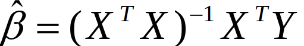

## Perhitungan

### Tahap 1

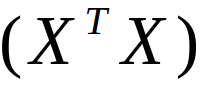

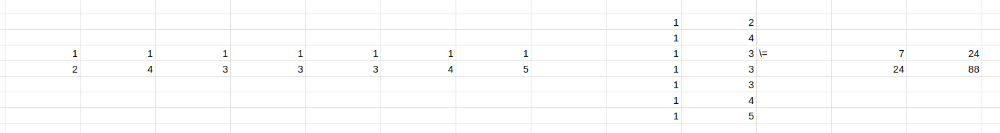

### Tahap 2

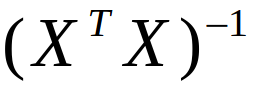

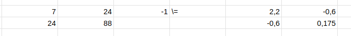

### Tahap 3

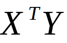

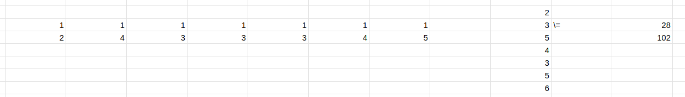

### Tahap 4

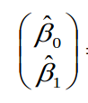

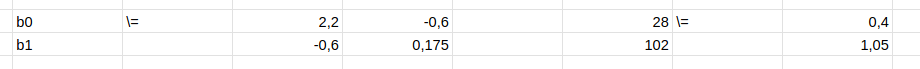

### Hasil

```
y = b1 x + b0
y = 1.05 x + 0.4
```

### GeoGebra Classic

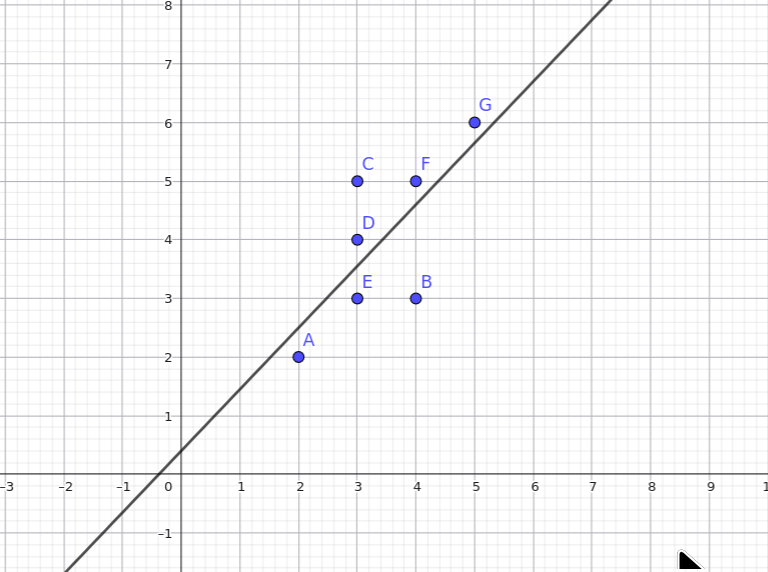

## Kode Program

```python
import numpy as np
import matplotlib.pyplot as plt
from sklearn.linear_model import LinearRegression

# 1. Siapkan data
x = np.array([2, 4, 3, 3, 3, 4, 5]).reshape(-1, 1)  # reshape(-1, 1) wajib untuk sklearn
y = np.array([2, 3, 5, 4, 3, 5, 6])

# 2. Buat dan latih model
model = LinearRegression()
model.fit(x, y)

# 3. Ekstrak parameter (b0 dan b1)
b0 = model.intercept_
b1 = model.coef_[0]

# 4. Prediksi nilai y
y_pred = model.predict(x)

# 5. Tampilkan output
print(f"b0 (Intercept) : {b0:.4f}")
print(f"b1 (Koefisien) : {b1:.4f}")
print(f"y (Prediksi)   : {np.round(y_pred, 4)}")

# 6. Plotting
plt.figure(figsize=(8, 6))
plt.scatter(x, y, color='blue', label='Data Asli', zorder=3)
plt.plot(x, y_pred, color='red', linewidth=2,
         label=f'Garis Regresi: y = {b0:.2f} + {b1:.2f}x', zorder=2)
plt.xlabel('x')
plt.ylabel('y')
plt.title('Linear Regression: Scatter Plot & Garis Regresi')
plt.legend()
plt.grid(True, linestyle='--', alpha=0.6)
plt.show()
```

Output:

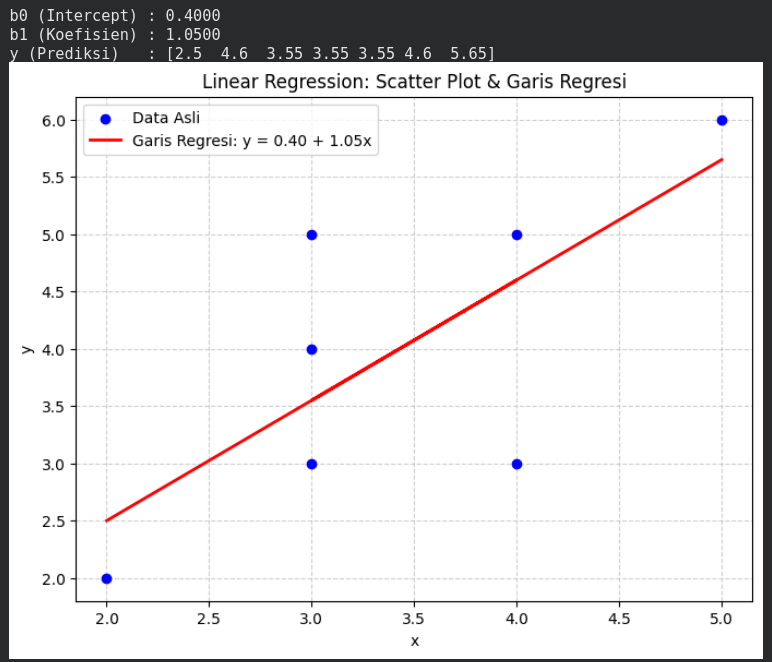
