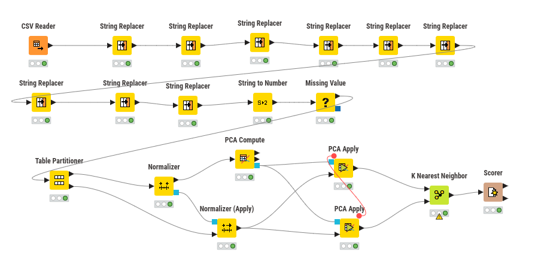
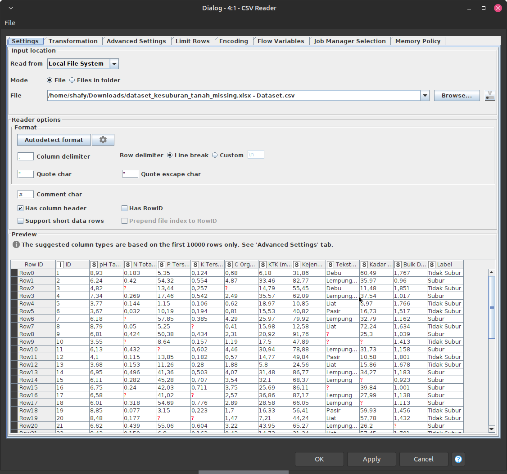
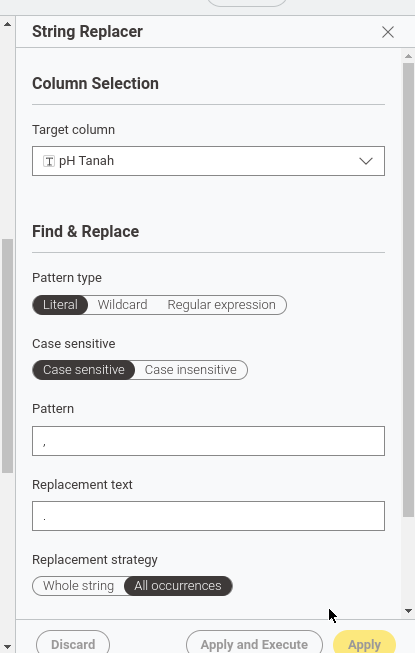
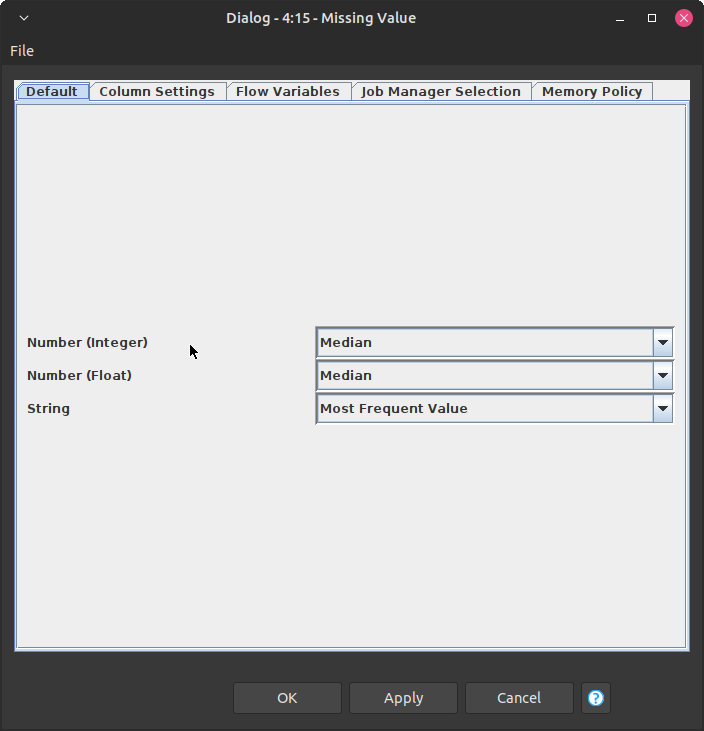
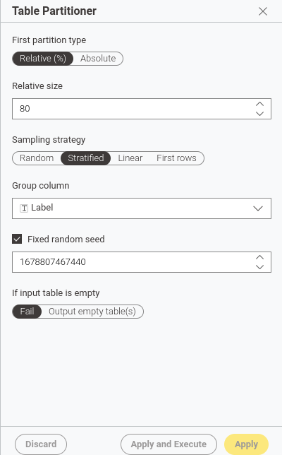
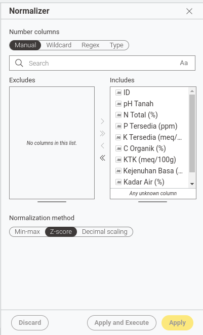
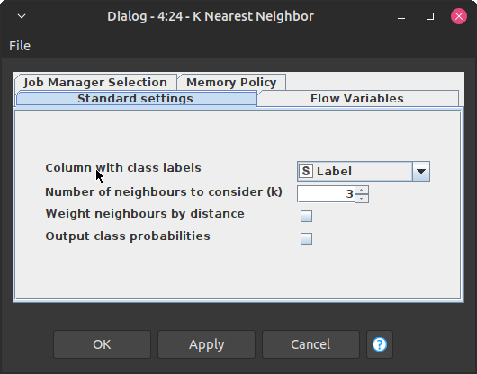
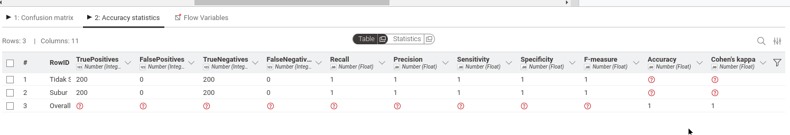

# UTS

knime:

1. Import dataset ke KNIME dengan menggunakan CSV.

    

2. Lakukan pembersihan data dengan mengubah tipe data string menjadi numerik untuk kolom-kolom yang relevan (pH Tanah, N Total (%), P Tersedia (ppm), K Tersedia (meq/100g), C Organik (%), KTK (meq/100g), Kejenuhan Basa (%), Tekstur Tanah, Kadar Air (%), Bulk Density (g/cm³)).

    

3. Missing value pada kolom numerik diisi dengan median, sedangkan untuk kolom kategorikal diisi dengan modus.

    

4. Melakukan partisi data menjadi data latih dan data uji dengan rasio 80:20.

    

5. Melakukan normalisasi data menggunakan z-score.

    

6. Membangun model KNN dengan k=3 dan melatihnya menggunakan data latih.

    

7. Menilai performa model menggunakan metrik evaluasi seperti accuracy, precision, recall, dan F1-score.

    
